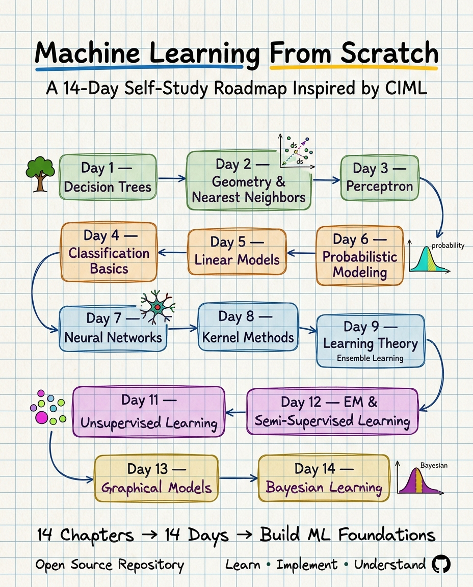

# ML Course, From Scratch

A 14-day, code-first walkthrough of *A Course in Machine Learning* by Hal Daumé III. The book is theory-only; this repository is what happens when every formula in it gets turned into code that actually runs.

[]()
[]()
[]()

<p align="center">
  
</p>

---

## What this is

Each day covers one chapter and follows the same pattern:

- A **from-scratch implementation** in plain NumPy — no `model.fit()` shortcuts
- Evaluation on a **real dataset**, never synthetic toy data
- A **correctness check** against the equivalent scikit-learn model
- A **companion guide** (`en.md`) — theory, code walkthrough, exercises
- A **notebook** (`notebooks/`) — the same material, self-contained and runnable end to end

## Where to start

New here? Read in order:

1. `notebooks/ch01-decision-trees.ipynb` — the shortest path to understanding the shape of every chapter that follows
2. `ch01-decision-trees/en.md` — same material, in write-up form
3. Pick your own path after that — chapters build on each other loosely, but each stands on its own

If you just want to *run* something: open any notebook and execute it top to bottom.

---

## Repository structure

```
ml-course-from-scratch/
│
├── assets/
│   └── roadmap.png
│
├── notebooks/                              self-contained .ipynb per chapter
│   ├── ch01-decision-trees.ipynb
│   ├── ch02-geometry-neighbors.ipynb
│   ├── ...
│   └── ch14-structured-bayesian-learning.ipynb
│
├── ch01-decision-trees/
├── ch02-geometry-neighbors/
├── ch03-perceptron/
├── ch04-practical-issues-beyond-binary/
├── ch05-linear-models/
├── ch06-probabilistic-modeling/
├── ch07-neural-networks/
├── ch08-kernel-methods/
├── ch09-learning-theory/
├── ch10-ensemble-efficient-learning/
├── ch11-unsupervised-learning/
├── ch12-em-semi-supervised/
├── ch13-graphical-models-online-learning/
├── ch14-structured-bayesian-learning/
│
└── README.md
```

Each chapter folder contains:

| File | Purpose |
|---|---|
| `*.py` | From-scratch implementation, run as a script, with experiments on real data |
| `en.md` | Companion write-up — objectives, concept, build steps, exercises |

`notebooks/` mirrors the same content in one interactive file per chapter, for reading rather than running from the terminal.

---

## Philosophy

The source book is theory-first and code-free. This repository exists to close that gap: translate every formula and algorithm into readable code, so that running a single script both reinforces the concept and verifies it against an established library.

---

## Source

Hal Daumé III — *A Course in Machine Learning* — [ciml.info](http://ciml.info)

## License

Educational use only.
