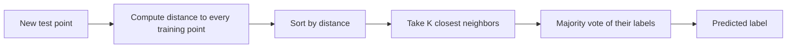

# Chapter 2: Geometry and Nearest Neighbors

> Every example is just a point in space — and once you accept that, distance becomes a learning algorithm.

**Type:** Learn + Build **Languages:** Python **Prerequisites:** Chapter 1 (Decision Trees) **Time:** ~45 minutes
**Source:** A Course in Machine Learning, Hal Daumé III — Chapter 2

## Learning Objectives
- Describe a dataset as a collection of points in a high-dimensional feature space.
- Implement a K-Nearest Neighbors (KNN) classifier from scratch and understand its decision rule.
- Implement K-Means clustering from scratch and understand the assignment/update loop.
- Explain how the hyperparameter K trades off underfitting and overfitting for KNN.
- Explain the curse of dimensionality and why distances become uninformative in high dimensions.

## The Problem
Decision trees (Chapter 1) work by asking a small sequence of yes/no questions about the most informative features. But what if you don't want to hand-pick which features matter? A very different idea is: represent every example as a vector of numbers (a point in space), and classify a new point based on which *other* points it is closest to. This is the geometric view of data, and it leads naturally to the K-Nearest Neighbors algorithm for classification and the K-Means algorithm for unsupervised clustering.

## The Concept



- **No training phase**: KNN just stores the training data; all the work happens at prediction time.
- **K controls the bias/variance trade-off**: K=1 memorizes noise (overfits); very large K collapses toward always predicting the majority class (underfits).
- **Feature scale matters**: since KNN relies purely on distance, unscaled features (e.g., one measured in millimeters, another in kilometers) silently dominate the distance calculation.
- **K-Means is the unsupervised cousin**: instead of using known labels, it alternates between assigning points to the nearest of K cluster centers and recomputing those centers as the mean of their assigned points.

## Build It

**1. Distance-based prediction (KNN).** For every test point, compute the Euclidean distance to all training points, sort, and let the K nearest vote:

```python
dists = np.sqrt(np.sum((self.X_train - x) ** 2, axis=1))
nn_idx = np.argsort(dists)[: self.k]
nn_labels = self.y_train[nn_idx]
values, counts = np.unique(nn_labels, return_counts=True)
preds[i] = values[np.argmax(counts)]
```

**2. Iterative clustering (K-Means).** Alternate between assignment and mean re-estimation until convergence:

```python
dists = np.linalg.norm(X[:, None, :] - self.centers_[None, :, :], axis=2)
labels = np.argmin(dists, axis=1)
for k in range(self.k):
    new_centers[k] = X[labels == k].mean(axis=0)
```

**Run it:**
```bash
python3 geometry_knn.py
```

**Expected output (abridged, real run):**
```
EXPERIMENT A: KNN on sklearn's Breast Cancer Wisconsin dataset
From-scratch KNN accuracy : 0.9591
sklearn KNN accuracy      : 0.9591
Prediction agreement rate : 1.0000

EXPERIMENT B: train/test accuracy vs K (underfitting <-> overfitting)
   K |  train acc |  test acc
   1 |     1.0000 |    0.9591
  10 |     0.9698 |    0.9649
 150 |     0.8995 |    0.9240

EXPERIMENT C: K-Means on sklearn's Wine dataset
From-scratch K-Means ARI vs true labels : 0.9149
sklearn K-Means      ARI vs true labels : 0.8975

EXPERIMENT D: curse of dimensionality (average pairwise distances)
Dimensions |  mean dist |  std/mean
         2 |     0.5195 |    0.4837
      2048 |    18.3439 |    0.0869
```
The from-scratch implementation matches sklearn's predictions exactly on the classification task (100% agreement), and produces a comparable clustering quality (Adjusted Rand Index) to sklearn's K-Means. The dimensionality experiment confirms the book's claim: as dimensions grow, all pairwise distances start to look the same (the relative spread `std/mean` shrinks), which is why KNN struggles in very high-dimensional, noisy feature spaces.

## Use It

| API / Function | When to use it |
|---|---|
| `KNNFromScratch(k).fit(X, y).predict(Xtest)` | Small-to-medium datasets, when you want an interpretable, non-parametric baseline classifier. |
| `KMeansFromScratch(k).fit(X)` | Unsupervised grouping when you believe data forms roughly round, equally-sized clusters. |
| `StandardScaler` (sklearn) | Always apply before KNN/K-Means when features are on different scales. |
| `sklearn.neighbors.KNeighborsClassifier` | Production use — has KD-tree/ball-tree acceleration for large datasets. |
| `sklearn.cluster.KMeans` | Production use — includes k-means++ smart initialization. |

## Exercises
1. Modify `KNNFromScratch` to implement **weighted voting**, where closer neighbors get a vote of `exp(-0.5 * distance**2)` instead of an equal vote (Eq. 2.3 in the book).
2. Run Experiment B without `StandardScaler` and compare the accuracy curve — how much does feature scaling matter here?
3. Extend `KMeansFromScratch` to implement the **furthest-first heuristic** for initialization instead of random selection, and check whether the Adjusted Rand Index improves.

## Key Terms

| Term | Common Assumption | Precise Meaning |
|---|---|---|
| Nearest Neighbor | "The closest point is always right" | A model with zero training cost that defers all computation to prediction time, using distance as its only inductive bias. |
| Decision Boundary | "Only matters for linear models" | The region in feature space where a classifier's predicted label changes; for 1-NN it is a jagged Voronoi-like boundary. |
| Curse of Dimensionality | "More features are always better" | The phenomenon where volumes, distances, and density estimates behave counter-intuitively as dimensionality grows, often making distance-based methods less reliable. |
| K-Means | "It always finds the true clusters" | An iterative algorithm that provably converges to *a* local optimum of within-cluster squared distance, but not necessarily the global optimum or the "true" grouping. |
