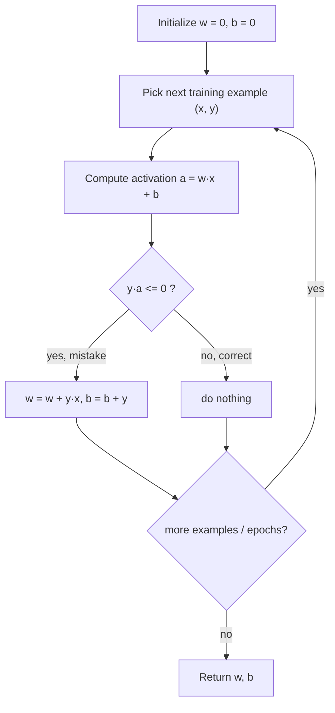

# Chapter 3: The Perceptron

> A neuron that only speaks up when it's wrong — and that one rule is enough to learn a hyperplane.

**Type:** Learn + Build **Languages:** Python **Prerequisites:** Chapter 1 (Decision Trees), Chapter 2 (Geometry & Nearest Neighbors) **Time:** ~40 minutes
**Source:** A Course in Machine Learning, Hal Daumé III — Chapter 3

## Learning Objectives
- Describe the biological motivation behind the perceptron and its linear activation.
- Classify the perceptron as an online, error-driven learning algorithm.
- Implement the perceptron algorithm for binary classification from scratch.
- Explain why permuting training examples every epoch matters for convergence speed.
- Contrast the vanilla perceptron with the averaged perceptron and explain why averaging generalizes better.

## The Problem
Decision trees only use a handful of features; KNN uses all features equally. Neither lets you learn *how much* each feature should matter. The perceptron solves this by learning one weight per feature — turning classification into finding a hyperplane that separates positive from negative examples. Unlike decision trees or KNN, the perceptron is **online** (looks at one example at a time) and **error-driven** (it only updates its weights when it makes a mistake).

## The Concept



- **Error-driven**: as long as an example is already correctly classified, the weights don't move — only mistakes trigger an update.
- **The `y·a <= 0` trick**: since labels are ±1, this single check replaces a more verbose "is the sign wrong" comparison.
- **Order matters**: presenting examples in a fixed order (e.g. all positives, then all negatives) can make the perceptron temporarily "forget" how to classify one class. Re-permuting the data every epoch avoids this and tends to converge faster.
- **Linear decision boundary**: the perceptron's boundary is the hyperplane perpendicular to `w`; it can only separate linearly-separable data (it will loop forever on XOR-like problems).
- **Averaging fixes a subtle flaw**: a single late mistake can overwrite weeks of good learning. The averaged perceptron keeps a running average of every weight vector seen during training, so no single late update can dominate the final model.

## Build It

**1. The core update rule (Algorithm 5 in the book):**

```python
a = self.w @ X[n] + self.b
if y[n] * a <= 0:          # mistake: y and a disagree in sign
    self.w += y[n] * X[n]
    self.b += y[n]
```

**2. Re-permuting every epoch (Section 3.2):**

```python
for _ in range(self.max_iter):
    if self.permute:
        rng.shuffle(order)   # new random order each pass over the data
    for n in order:
        ...
```

**3. Averaged perceptron (Algorithm 7) — track a running cache of the weights:**

```python
if y[n] * (w @ X[n] + b) <= 0:
    w += y[n] * X[n]
    b += y[n]
    u += y[n] * c * X[n]     # cached weight update
    beta += y[n] * c
c += 1
# final answer is the *average*, computed via a telescoping sum:
self.w = w - u / c
self.b = b - beta / c
```

**Run it:**
```bash
python3 perceptron.py
```

**Expected output (abridged, real run on Breast Cancer Wisconsin, 569 examples / 30 features):**
```
EXPERIMENT A: Perceptron on sklearn's Breast Cancer Wisconsin dataset
From-scratch Perceptron test accuracy : 0.9591
sklearn Perceptron test accuracy      : 0.9532

EXPERIMENT C: train/test accuracy vs MaxIter (Section 3.2, Figure 3.3)
 MaxIter |  train acc |  test acc
       1 |     0.9673 |    0.9708
      50 |     0.9849 |    0.9532
     100 |     0.9925 |    0.9708
     200 |     0.9874 |    0.9415   <- overfitting: train keeps rising, test falls

EXPERIMENT D: vanilla vs. averaged perceptron (Section 3.6)
 MaxIter |  vanilla test acc |  averaged test acc
     100 |             0.9708 |             0.9766
     200 |             0.9415 |             0.9649   <- averaged degrades far less
```
The from-scratch perceptron performs comparably to `sklearn.linear_model.Perceptron` (small differences are expected — both are order-sensitive). Experiment C reproduces the book's overfitting curve from Figure 3.3: as `MaxIter` grows, training accuracy climbs toward 1.0 while test accuracy eventually drops, confirming the need for early stopping. Experiment D confirms Section 3.6's claim: at `MaxIter=200`, vanilla perceptron's test accuracy has collapsed to 0.9415, while the averaged perceptron only drops to 0.9649 — averaging is measurably more robust to overtraining.

## Use It

| API / Function | When to use it |
|---|---|
| `PerceptronFromScratch(max_iter, permute).fit(X, y).predict(Xtest)` | Simple, fast, online linear classifier on separable-ish data. |
| `AveragedPerceptronFromScratch(max_iter, permute).fit(X, y)` | Same as above but more robust to overtraining — prefer this in practice. |
| `sklearn.linear_model.Perceptron` | Production use — has L1/L2 regularization options and optimized solvers. |
| `StandardScaler` (sklearn) | Apply before training — perceptron updates are additive in `x`, so unscaled features distort the geometry. |

## Exercises
1. Modify the training loop to record the number of mistakes made per epoch, and plot it — do mistakes decrease monotonically?
2. Implement the **voted perceptron** (Eq. 3.17 in the book): instead of averaging weight vectors, store every intermediate `(w, b)` along with its survival count, and have each one "vote" at test time. Compare its test accuracy and prediction time to the averaged perceptron.
3. Run the perceptron on a synthetic XOR-style dataset (4 points, not linearly separable) and confirm it never converges — cap the epochs and observe the weights oscillating instead of stabilizing.

## Key Terms

| Term | Common Assumption | Precise Meaning |
|---|---|---|
| Perceptron | "Just a simple neuron toy" | An online, error-driven linear classifier whose decision boundary is the hyperplane perpendicular to its learned weight vector. |
| Margin | "Just the gap between classes" | The distance from the separating hyperplane to the closest training point; the perceptron's convergence speed is bounded by `1/margin²`. |
| Linearly Separable | "Any two-class dataset" | A dataset for which *some* hyperplane perfectly separates the classes; the perceptron is only guaranteed to converge if this holds. |
| Averaging | "A minor implementation detail" | A regularization-like technique that returns the mean of all weight vectors seen during training, reducing sensitivity to the order and recency of examples. |
