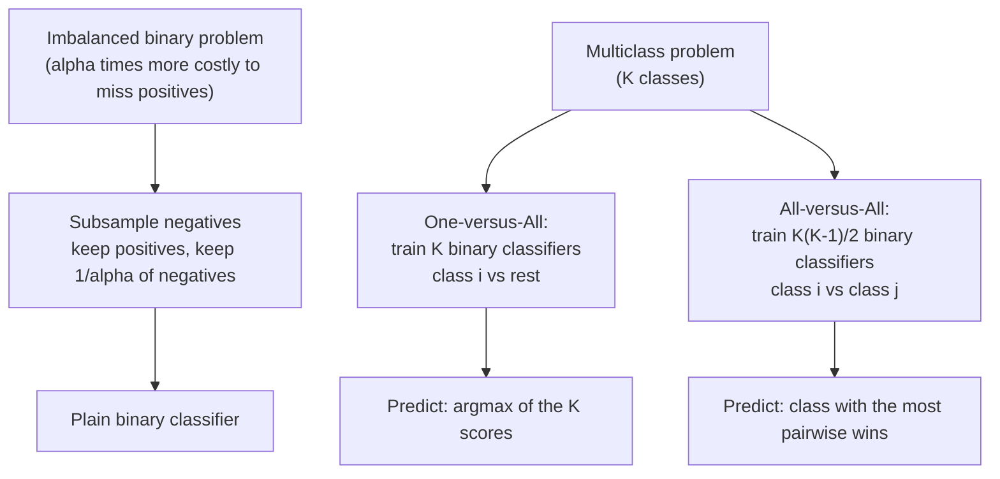

# Chapter 5: Beyond Binary Classification

> Every complex prediction problem — imbalanced, multiclass, ranked — can be reduced to the binary classifier you already know how to build.

**Type:** Learn + Build **Languages:** Python **Prerequisites:** Chapter 4 (Practical Issues) **Time:** ~45 minutes
**Source:** A Course in Machine Learning, Hal Daumé III — Chapter 5

## Learning Objectives
- Represent imbalanced classification as an alpha-weighted binary classification problem.
- Implement subsampling as a reduction from weighted to plain binary classification.
- Implement One-versus-All (OVA) and All-versus-All (AVA) reductions from multiclass to binary classification.
- Understand the trade-off in training cost and robustness between OVA and AVA.

## The Problem
Binary classifiers are the "black box" you already know how to build (decision trees, KNN, perceptron). But most real prediction problems aren't plain binary classification: fraud detection has 1000x more legitimate transactions than fraudulent ones (imbalanced data), and document categorization has more than 2 possible topics (multiclass). Rather than inventing new algorithms from scratch, this chapter shows how to *reduce* these harder problems down to ordinary binary classification, reusing everything you already have.

## The Concept



- **Reductions preserve guarantees**: if your binary classifier achieves error `e`, the theory says the weighted predictor achieves error `alpha * e` (Theorem 2) — the reduction doesn't lose more than that factor.
- **Subsampling can go too far**: for large `alpha`, you throw away almost all of the negative examples, which can leave too little data to learn from if the dataset is already small — the theory's guarantee is about the *rate*, not about having enough absolute data.
- **OVA trains K classifiers, AVA trains K(K-1)/2**: AVA scales quadratically in the number of classes, but each of its sub-problems is "easier" (only involves 2 classes' worth of data), which can make it more accurate in practice, at higher computational cost (Theorem 3 vs Theorem 4).
- **OVA can be "brittle"**: since ties are broken by whichever binary classifier's score is highest, a single confidently-wrong classifier can override several correct ones.

## Build It

**1. Subsampling for imbalanced data (Algorithm 11):**

```python
neg_idx = np.where(y == -1)[0]
u = rng.uniform(0, 1, size=len(neg_idx))
drop = neg_idx[u >= 1.0 / alpha]   # drop most negatives, keep 1/alpha fraction
keep[drop] = False
```

**2. One-versus-All (Algorithm 12/13):**

```python
for c in classes:
    y_bin = np.where(y == c, 1, -1)      # class c vs everyone else
    models[c] = base_learner().fit(X, y_bin)
# prediction: whichever classifier's decision_function is highest wins
scores = [models[c].decision_function(X) for c in classes]
prediction = classes[argmax(scores)]
```

**3. All-versus-All (Algorithm 14/15):**

```python
for ci, cj in all_pairs(classes):
    mask = (y == ci) | (y == cj)
    y_bin = np.where(y[mask] == ci, 1, -1)
    models[(ci, cj)] = base_learner().fit(X[mask], y_bin)
# prediction: each pairwise classifier casts one vote; most votes wins
```

**Run it:**
```bash
python3 beyond_binary_classification.py
```

**Expected output (abridged, real runs):**
```
EXPERIMENT A: subsampling for imbalanced classification (Section 5.1)
Imbalanced dataset: 16 positive vs 357 negative (4.3% positive)
alpha (importance of positive class) = 22.73

            method | accuracy |  F1 (positive class)
    no subsampling |   0.9911 |               0.9091
        subsampled |   0.7054 |               0.2326

Training set sizes: full=261  subsampled=28 (11 positive + 17 negative kept)
```
Here subsampling actually *hurts*, not helps: with `alpha ≈ 22.7` and only 16 minority-class examples to begin with, subsampling shrinks the training set down to just 28 points — far too little for the perceptron to learn a good boundary from. This is a real, honest illustration of the book's own caveat (Section 5.1): subsampling "throws out a lot of data (especially for large alpha)." It works well when you have plenty of data to spare; it can backfire when the minority class is already scarce.

```
EXPERIMENT B: OVA / AVA multiclass reductions on sklearn's Digits dataset
Dataset shape: 1797 examples, 64 features, 10 classes

                      method |  # binary classifiers | test accuracy
            From-scratch OVA |                    10 |        0.9426
            From-scratch AVA |                    45 |        0.9667
     sklearn OneVsRest (OVA) |                    10 |        0.9315
      sklearn OneVsOne (AVA) |                    45 |        0.9593
```
On the 10-class Digits dataset, AVA (45 pairwise classifiers) outperforms OVA (10 one-vs-rest classifiers) both in the from-scratch implementation and in sklearn — matching the book's discussion that AVA's easier sub-problems often translate into better accuracy, at roughly 4.5x the number of models trained.

## Use It

| API / Function | When to use it |
|---|---|
| `subsample_map(X, y, alpha)` | Imbalanced binary classification with a large-enough dataset that you can afford to drop majority-class examples. |
| `OVAClassifier(base_learner_fn)` | Multiclass problems where training speed matters and you want linear scaling in the number of classes. |
| `AVAClassifier(base_learner_fn)` | Multiclass problems where accuracy matters more than training time and the number of classes is modest. |
| `sklearn.multiclass.OneVsRestClassifier` / `OneVsOneClassifier` | Production use — parallelizable, works with any sklearn-compatible binary estimator. |

## Exercises
1. Implement the **oversampling** alternative to subsampling (replicate each positive example `alpha` times instead of dropping negatives) and re-run Experiment A — does it recover the F1 score that plain subsampling lost?
2. Extend `OVAClassifier` to break ties using a *confidence-weighted* vote instead of a raw `argmax`, and see if it changes accuracy on a dataset with more class overlap.
3. Time the training of OVA vs AVA as the number of classes grows (e.g. on subsets of the Digits dataset with 3, 5, 7, 10 classes) and confirm the K vs K(K-1)/2 scaling predicted by the book.

## Key Terms

| Term | Common Assumption | Precise Meaning |
|---|---|---|
| Alpha-Weighted Classification | "Just a fancy accuracy metric" | A binary classification variant where misclassifying a positive example costs `alpha` times as much as misclassifying a negative one. |
| Subsampling | "Always improves imbalanced learning" | A reduction that discards a `1 - 1/alpha` fraction of the majority class; provably optimal in error *rate*, but can leave too little absolute data if the dataset is small. |
| One-versus-All (OVA) | "The only way to do multiclass" | A reduction training one binary classifier per class (class vs. rest); linear in the number of classes but can be brittle to a single overconfident wrong classifier. |
| All-versus-All (AVA) | "Just OVA done more times" | A reduction training one binary classifier per *pair* of classes; quadratic in the number of classes but often more accurate since each sub-problem is simpler. |
