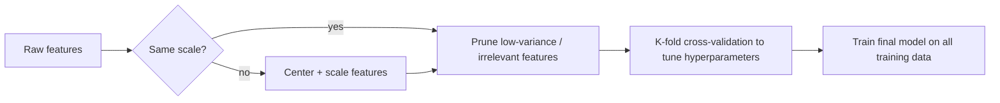

# Chapter 4: Practical Issues

> Going from a textbook algorithm to a working system is more art than science — but the art is learnable.

**Type:** Learn + Build **Languages:** Python **Prerequisites:** Chapter 1-3 **Time:** ~40 minutes
**Source:** A Course in Machine Learning, Hal Daumé III — Chapter 4

## Learning Objectives
- Explain how to use cross-validation to estimate future performance without touching test data.
- Perform basic feature engineering: centering, scaling, and variance-based pruning.
- Compare the sensitivity of decision trees, KNN, and the perceptron to feature scale and irrelevant features.
- Explain why decision trees are naturally more robust to noisy features than distance/dot-product based models.

## The Problem
You now know three qualitatively different learning models (decision trees, KNN, perceptron). But going from "I understand the algorithm" to "I have a system that performs well" involves many practical choices that the algorithms themselves don't make for you: how do you represent your data, should you rescale it, what do you do about useless features, and how do you honestly estimate how well your model will do in the future without ever touching your test set?

## The Concept



- **Feature scale matters differently per model**: decision trees only compare a feature to a threshold, so monotonic rescaling never changes a split. KNN and the perceptron both use the numeric feature values directly (in a distance or a dot product), so an unscaled feature can silently dominate.
- **Irrelevant features hurt distance-based models most**: as shown in Chapter 2, distances become less informative as dimensionality grows; adding noise features pushes KNN toward this regime fastest.
- **Cross-validation trades compute for robustness**: instead of holding out one fixed development set, K-fold CV rotates through K different splits and averages the result, giving a lower-variance performance estimate at the cost of K-times more training.
- **Pruning is a form of regularization**: throwing out uninformative features (e.g. ones with near-zero variance) reduces both computation and the risk of the model latching onto noise.

## Build It

**1. Centering and scaling (Eq. 4.1–4.6):**

```python
mu = X_train.mean(axis=0)
sigma = X_train.std(axis=0)
sigma[sigma == 0] = 1.0
X_train_norm = (X_train - mu) / sigma
X_test_norm = (X_test - mu) / sigma   # reuse train statistics on test!
```

**2. K-fold cross-validation (Algorithm 8, simplified):**

```python
for fold in folds:
    test_idx = fold
    train_idx = everything else
    model = model_fn().fit(X[train_idx], y[train_idx])
    scores.append(accuracy(y[test_idx], model.predict(X[test_idx])))
```

**Run it:**
```bash
python3 practical_issues.py
```

**Expected output (abridged, real run on Breast Cancer Wisconsin):**
```
EXPERIMENT A: effect of feature normalization (Section 4.3)
                       model |  raw features acc |  normalized acc
                   KNN (k=5) |            0.9240 |          0.9591
                  Perceptron |            0.9064 |          0.9649
     Decision Tree (depth=4) |            0.9240 |          0.9240   <- unchanged!

EXPERIMENT B: robustness to irrelevant features (Section 4.2, Figure 4.6)
# noise feats |  DT acc |  KNN acc |  Perceptron acc
            0 |  0.9240 |   0.9591 |          0.9649
          240 |  0.9181 |   0.8713 |          0.9181   <- KNN drops the most

EXPERIMENT C: from-scratch 10-fold CV vs sklearn.cross_val_score
From-scratch 10-fold CV : mean=0.9280  std=0.0354
sklearn 10-fold CV      : mean=0.9175  std=0.0407
```
Normalization has zero effect on the decision tree (as predicted) but improves both KNN and perceptron by 3-6 points. Adding 240 pure-noise features barely dents the decision tree (0.9240 -> 0.9181) but drags KNN down nearly 9 points (0.9591 -> 0.8713), confirming that distance-based models are far more vulnerable to irrelevant features. The from-scratch cross-validation implementation produces a mean accuracy close to sklearn's `cross_val_score` (folds differ due to shuffling, so an exact match isn't expected).

## Use It

| API / Function | When to use it |
|---|---|
| `center_and_scale(X_train, X_test)` | Before training KNN, perceptron, or any distance/dot-product-based model. |
| `cross_validate(model_fn, X, y, K=10)` | Estimating generalization performance or tuning a hyperparameter without a separate held-out dev set. |
| Variance-based pruning (`X.var(axis=0)`) | Quick first-pass feature selection before training, especially with many near-constant features. |
| `sklearn.model_selection.cross_val_score` | Production use — vectorized, supports many scoring metrics and stratified folds. |

## Exercises
1. Modify Experiment A to also test a `max_depth=None` (unpruned) decision tree — does normalization matter more or less as the tree gets deeper?
2. Implement leave-one-out cross-validation (`K = N`) for the KNN classifier using the efficient approach described in the book (Algorithm 9), and compare its runtime to naive 10-fold CV.
3. Add an `abs_scaling` option to `center_and_scale` that divides by the maximum absolute value instead of the standard deviation (Eq. 4.3), and compare its effect on perceptron accuracy.

## Key Terms

| Term | Common Assumption | Precise Meaning |
|---|---|---|
| Normalization | "Always helps, always do it" | A per-feature transformation (centering + scaling) that helps models sensitive to raw feature magnitude; irrelevant to models that only compare feature values to thresholds. |
| Cross-Validation | "Just a fancier train/test split" | A resampling procedure that trains and evaluates K times on K different partitions, trading extra computation for a lower-variance estimate of generalization performance. |
| Irrelevant Feature | "Harmless noise" | A feature whose expected value doesn't depend on the label; harmless in small numbers but can dominate distance-based models when numerous. |
| Feature Pruning | "Only for saving memory" | Removing low-signal (e.g. low-variance) features before training, which is itself a form of regularization against overfitting to noise. |
