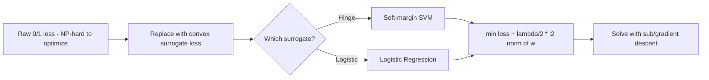

# Chapter 6: Linear Models

> A decision tree asks questions, a nearest-neighbor votes with its neighbors — a linear model just adds up evidence, one weighted feature at a time.

**Type:** Learn + Build **Languages:** Python **Prerequisites:** Chapter 3 (The Perceptron) **Time:** ~50 minutes
**Source:** A Course in Machine Learning, Hal Daumé III — Chapter 6

## Learning Objectives
- Define and plot the four common surrogate loss functions: hinge, logistic, exponential, squared.
- Implement a generic regularized linear classifier trained with (sub)gradient descent, for both hinge loss (soft-margin SVM) and logistic loss (logistic regression).
- Explain why the 2-norm regularizer shrinks weights, and observe this trade-off empirically on real data.
- Derive and implement the closed-form solution for 2-norm regularized squared loss (ridge regression).

## The Problem
The perceptron finds *a* separating hyperplane, but stops as soon as training data is (nearly) correctly classified — it has no notion of "how good" that hyperplane is, and no principled way to handle non-separable data. Linear Models generalizes the perceptron by separating the *model* (a linear function `w·x + b`) from the *algorithm* used to fit it, turning learning into an explicit optimization problem: minimize a **loss function** (how wrong are we on the training data?) plus a **regularizer** (how complex is the model?). Different choices of loss and regularizer recover the perceptron, logistic regression, and the support vector machine as special cases of the same framework.

## The Concept



- **Zero/one loss is NP-hard to optimize directly**, because tiny parameter changes cause discontinuous jumps in the loss. Surrogate losses (hinge, logistic, exponential, squared) are convex upper bounds that are easy to optimize instead.
- **Regularization controls complexity**: adding `(lambda/2)||w||^2` to the objective shrinks the weight vector, which is exactly what "simple function" means for a linear model (Section 6.3: small weights → small rate of change → less sensitive to any one feature).
- **Hinge loss + 2-norm regularizer = soft-margin SVM.** Logistic loss + 2-norm regularizer = regularized logistic regression. Same optimization machinery, different loss function.
- **Squared loss has a closed-form solution** (no iterative optimization needed) when paired with a 2-norm regularizer: this is ridge regression, `w = (XᵀX + λI)⁻¹Xᵀy`.

## Build It

**1. Pick a loss and take its (sub)gradient with respect to the activation `a = w·x + b`.** For hinge loss, `∂/∂a max(0, 1 - ya) = -y` whenever the margin `ya < 1`, else `0`. For logistic loss, `∂/∂a log(1+exp(-ya)) = -y·sigmoid(-ya)`:

```python
def hinge_loss_grad(y, a):
    margin = y * a
    return np.where(margin < 1, -y, 0.0)

def logistic_loss_grad(y, a):
    z = np.clip(y * a, -30, 30)   # avoid overflow for very confident predictions
    return -y / (1.0 + np.exp(z))
```

**2. Full-batch gradient descent on the regularized objective**, with a shrinking step size `eta_k = eta0 / sqrt(k)`:

```python
a = X @ self.w + self.b
grad_w = (X.T @ grad_fn(y, a)) / N + self.lam * self.w
eta = self.eta0 / np.sqrt(k)
self.w -= eta * grad_w
```

**3. Closed-form ridge regression**, centering the data so the intercept is not itself regularized:

```python
Xc, yc = X - X.mean(axis=0), y - y.mean()
w = np.linalg.solve(Xc.T @ Xc + lam * np.eye(D), Xc.T @ yc)
```

**Run it:**
```bash
python3 linear_models.py
```

**Expected output (abridged, real run on Breast Cancer Wisconsin + Diabetes datasets):**
```
EXPERIMENT A: From-scratch linear SVM (hinge loss) vs sklearn LinearSVC
From-scratch hinge-loss SVM test accuracy : 0.9825
sklearn LinearSVC        test accuracy     : 0.9474
Prediction agreement rate                  : 0.9532

EXPERIMENT B: From-scratch logistic regression vs sklearn LogisticRegression
From-scratch logistic-loss classifier test accuracy : 0.9825
sklearn LogisticRegression       test accuracy       : 0.9532
Prediction agreement rate                            : 0.9474

EXPERIMENT C: Regularization strength (lambda) vs train/test accuracy
    lambda |  train acc |  test acc |    ||w||
    0.0001 |     0.9874 |    0.9766 |   2.7295
    0.0100 |     0.9849 |    0.9825 |   2.1473
    1.0000 |     0.9322 |    0.9415 |   0.4420
   10.0000 |     0.7513 |    0.7193 |   0.1104

EXPERIMENT D: Closed-form ridge regression vs sklearn Ridge
From-scratch closed-form ridge   test MSE : 2820.4905
sklearn Ridge                    test MSE : 2820.4905
Max abs weight difference                : 0.000000
```
The from-scratch models track sklearn's reference implementations closely (small differences come from sklearn's LinearSVC/LogisticRegression using different solvers, e.g. L-BFGS or dual coordinate descent, instead of plain gradient descent). Experiment C directly shows `||w||` shrinking as `lambda` grows, and the closed-form ridge regression in Experiment D matches sklearn's `Ridge` to six decimal places, confirming the matrix-algebra derivation.

## Use It

| API / Function | When to use it |
|---|---|
| `LinearClassifierFromScratch(loss="hinge")` | Want a maximum-margin linear classifier; robust to outliers past the margin. |
| `LinearClassifierFromScratch(loss="logistic")` | Want calibrated probability-like outputs, not just a hard decision. |
| `RidgeRegressionFromScratch(lam)` | Real-valued targets, want a fast closed-form fit with L2 shrinkage. |
| `sklearn.svm.LinearSVC` | Production-grade SVM training (LIBLINEAR solver, much faster than plain gradient descent). |
| `sklearn.linear_model.LogisticRegression` | Production-grade logistic regression with multiple solvers and multiclass support. |

## Exercises
1. Add the exponential loss (`exp(-ya)`) and squared loss (`(y-a)^2`) gradients to the `LOSSES` dictionary and compare all four surrogate losses on the same train/test split.
2. Replace the fixed step-size schedule `eta0/sqrt(k)` with a line-search or Adam-style adaptive step size, and see how much faster the model converges.
3. Implement the 1-norm (L1) regularizer with subgradient truncation (Section 12.3 of the book) and check how many weights become exactly zero on the Breast Cancer dataset.

## Key Terms

| Term | Common Assumption | Precise Meaning |
|---|---|---|
| Regularizer | "Just a penalty to prevent big numbers" | A term added to the training objective that encodes inductive bias about which functions are "simple," independent of how well they fit the training data. |
| Hinge Loss | "Just another name for 0/1 loss" | A convex, piecewise-linear upper bound on 0/1 loss that only penalizes points *inside* the margin, giving rise to sparse "support vectors." |
| Support Vector Machine | "A totally different algorithm from logistic regression" | The specific case of the general regularized-loss framework where the loss is hinge loss; shares its optimization machinery with logistic regression. |
| Closed-form Solution | "Only exists for 'easy' toy problems" | An exact algebraic solution (here, one matrix inversion) that some loss/regularizer combinations admit, avoiding iterative optimization entirely. |
