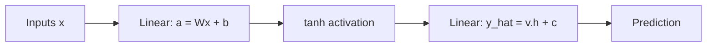

# Chapter 7: Neural Networks

> A single perceptron can only draw a straight line through your data. Stack a hidden layer behind it, and it can draw almost anything.

**Type:** Learn + Build **Languages:** Python **Prerequisites:** Chapter 3 (The Perceptron) **Time:** ~50 minutes
**Source:** A Course in Machine Learning, Hal Daumé III — Chapter 8

## Learning Objectives
- Explain the biological inspiration behind multi-layer neural networks and the role of the activation (link) function.
- Implement forward propagation and back-propagation from scratch for a two-layer network.
- Explain why bias terms are necessary, using the XOR problem as a concrete counter-example.
- Describe how the number of hidden units and training iterations both act as a form of inductive bias / regularization.
- Contrast a two-layer network's representational power with that of the perceptron.

## The Problem
The perceptron (Chapter 3) can only represent linear decision boundaries — it fundamentally cannot solve the XOR problem, since no straight line separates XOR's positive and negative points. Decision trees and KNN can express non-linear boundaries, but at the cost of losing the clean, optimization-friendly structure of a linear model. Neural networks resolve this tension: they chain together perceptron-like units, with a non-linear activation function at each hidden unit, so the overall function becomes non-linear while every individual computation stays simple and differentiable.

## The Concept



- **Two-layer networks are universal approximators**: with enough hidden units, a two-layer network can approximate any continuous function arbitrarily well (Cybenko/Hornik theorem).
- **Back-propagation = gradient descent + the chain rule**: the output layer's gradient is a simple linear-model gradient; the hidden layer's gradient is obtained by pushing the output error backward through the `tanh` derivative.
- **Bias terms matter**: `tanh(w·x)` is an *odd* function of `x`. Without a bias, a network can only represent functions that are odd in `x` — and XOR's target is *even* (flipping the sign of both inputs doesn't flip the label), so a bias-free network can never solve it, no matter how many hidden units it has.
- **Capacity is controlled by hidden units and training time**: more hidden units, or more gradient steps, let the network fit the training data more closely — this helps only up to a point, after which test performance degrades (overfitting), just like decision tree depth in Chapter 1.

## Build It

**1. Forward propagation** (Algorithm 8.1, with bias terms added):

```python
a = X @ self.W + self.b      # pre-activation of hidden units
h = np.tanh(a)                # hidden activations
y_hat = h @ self.v + self.c   # output unit (linear)
```

**2. Back-propagation** (Section 8.2 — gradient of squared error, chain rule through `tanh`):

```python
e = y - y_hat
grad_v = -(e[:, None] * h).sum(axis=0)                       # output-layer gradient
delta = (-e[:, None] * self.v[None, :]) * (1 - h ** 2)        # push error back through tanh'
grad_W = X.T @ delta                                           # hidden-layer gradient
```

**Run it:**
```bash
python3 neural_network.py
```

**Expected output (abridged, real run):**
```
EXPERIMENT A: Two-layer net on sklearn's Breast Cancer dataset
From-scratch net accuracy : 0.9649
sklearn MLP accuracy      : 0.9415

EXPERIMENT B: train/test accuracy vs hidden units K
   K |  train acc |  test acc
   1 |     0.9899 |    0.9649
  50 |     0.9975 |    0.9766
 100 |     1.0000 |    0.9591   <- starting to overfit (train=100%, test drops)

EXPERIMENT D: XOR problem (perceptron cannot solve; 2-layer net can)
True labels:      [-1.  1.  1. -1.]
Predicted labels: [-1  1  1 -1]
Accuracy: 1.0000  (a linear perceptron cannot exceed 0.75 here)
```
The from-scratch network is competitive with (and here slightly ahead of) scikit-learn's `MLPClassifier` on real tumor-diagnosis data, and it solves XOR perfectly once bias terms are included — while a single linear perceptron is mathematically incapable of exceeding 75% accuracy on that same problem.

## Use It

| API / Function | When to use it |
|---|---|
| `TwoLayerNetFromScratch(n_hidden, lr, n_iter).fit(X, y)` | Small/medium tabular datasets where you want to see exactly what back-prop is doing. |
| `sklearn.neural_network.MLPClassifier` | Production use — supports multiple layers, adaptive learning rates, and mini-batching. |
| `activation="tanh"` | Classic choice; bounded and zero-centered, unlike ReLU (which this book predates). |
| `hidden_layer_sizes=(K,)` | Choose `K` roughly proportional to `N/D` (Section 8.1 heuristic) as a starting point, then tune on held-out data. |

## Exercises
1. Replace the squared-error loss with logistic loss (Chapter 6) and re-derive the back-propagation gradients — how do `grad_v` and `delta` change?
2. Add a second hidden layer to `TwoLayerNetFromScratch` and re-run the XOR experiment — does it still need bias terms at every layer?
3. Reproduce Figure 3.3-style overfitting curves by plotting train/test accuracy against `n_iter` at several fixed values of `n_hidden`.

## Key Terms

| Term | Common Assumption | Precise Meaning |
|---|---|---|
| Hidden Unit | "Just an extra output" | An intermediate neuron whose activation is a non-linear function of a linear combination of inputs, never directly observed as a label. |
| Back-propagation | "A special neural-network trick" | Ordinary gradient descent combined with the chain rule, applied to a computation graph with more than one layer. |
| Bias Term | "A minor implementation detail" | A learnable constant offset that lets a unit's decision threshold move away from the origin — provably required to represent even simple functions like XOR. |
| Universal Approximation | "Any network can learn anything, easily" | A theorem about *representational* capacity (a function exists), which says nothing about whether gradient descent will actually *find* that function. |
