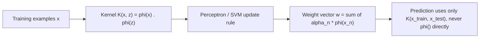

# Chapter 8: Kernel Methods

> You don't need to expand your features to use them — you just need to know how to take their dot product.

**Type:** Learn + Build **Languages:** Python **Prerequisites:** Chapter 3 (The Perceptron) **Time:** ~45 minutes
**Source:** A Course in Machine Learning, Hal Daumé III — Chapter 9

## Learning Objectives
- Explain how the kernel trick avoids explicitly computing an exploded feature space.
- Implement linear, polynomial, and RBF kernels from scratch.
- Implement the kernelized perceptron (representer theorem in action) and extend it to multi-class problems via one-vs-rest.
- Compare kernelized models against scikit-learn's SVC (also a kernel machine) on real data.
- Explain the connection between "confusable" training points and support vectors.

## The Problem
Linear models are convex and easy to optimize, but they can only express linear decision boundaries. Chapter 4 showed you can get around this by exploding your feature space (e.g., adding all pairwise products), but this is computationally prohibitive once you have more than a few hundred features — a quadratic expansion alone squares both your memory and (roughly) your data requirements. The kernel trick asks: can we get the benefit of this feature explosion without ever actually constructing the expanded vectors?

## The Concept



- **Representer theorem**: throughout training, the perceptron's weight vector is always a linear combination of the (mapped) training examples, so every computation — training and prediction — can be rewritten purely in terms of dot products between examples.
- **A kernel is just a generalized dot product**: `K(x, z) = φ(x) · φ(z)`. Polynomial kernels `(1 + x·z)^d` correspond to feature expansions with all degree-`d` combinations of features; RBF kernels `exp(-γ‖x-z‖²)` behave like an infinite-dimensional feature expansion and act like a Gaussian "vote" from every nearby training point.
- **Same cost, more power**: computing a degree-3 polynomial kernel costs exactly the same as computing a plain dot product (plus one add and one power) — you get cubic feature interactions "for free."
- **Only some points matter**: the kernel perceptron (like the SVM) only updates on points it currently misclassifies. Points that are never confusable with the wrong class end up with zero weight — conceptually the same idea as support vectors in an SVM (Section 9.6).

## Build It

**1. Kernels as drop-in replacements for the dot product** (Eq 9.13, 9.18):

```python
def polynomial_kernel(X, Z, degree=3):
    return (1.0 + X @ Z.T) ** degree

def rbf_kernel(X, Z, gamma=0.05):
    sq_dists = np.sum(X**2, axis=1)[:, None] + np.sum(Z**2, axis=1)[None, :] - 2 * X @ Z.T
    return np.exp(-gamma * np.maximum(sq_dists, 0.0))
```

**2. Kernelized perceptron training** (Algorithm 9.2 — note the weight vector never appears explicitly):

```python
K = self.kernel_fn(X, X)          # precompute the full Gram matrix once
for _ in range(self.n_iter):
    for i in range(n):
        a = np.sum(self.alpha * y * K[i]) + self.b   # activation via kernel products only
        if y[i] * a <= 0:
            self.alpha[i] += 1     # mistake-driven update
            self.b += y[i]
```

**Run it:**
```bash
python3 kernel_methods.py
```

**Expected output (abridged, real run):**
```
EXPERIMENT A: Kernelized Perceptron (OVA) on sklearn's Wine dataset
  kernel |  train acc |  test acc
  linear |     1.0000 |    0.9444
    poly |     1.0000 |    0.9259
     rbf |     1.0000 |    0.9815

--- Sanity check vs sklearn.svm.SVC ---
SVC(kernel=linear ) test acc: 0.9630
SVC(kernel=poly   ) test acc: 0.9074
SVC(kernel=rbf    ) test acc: 1.0000

EXPERIMENT C: how many training points actually matter?
Training examples that ever triggered a perceptron update: 24 / 249 (9.6%)
```
The RBF kernel gives the best test accuracy for both the from-scratch kernel perceptron and scikit-learn's SVC on the same data — the two independent implementations agree on which kernel wins, which is a good correctness signal. Experiment C confirms the book's point directly: fewer than 10% of training examples ever triggered a weight update, echoing the support-vector intuition that only "confusable" points near the decision boundary matter.

## Use It

| API / Function | When to use it |
|---|---|
| `KernelPerceptronFromScratch(kernel="rbf").fit(X, y)` | Binary classification where you suspect a non-linear boundary and want an easy-to-inspect model. |
| `OneVsRestKernelPerceptron` | Multi-class extension via Chapter 5's OVA reduction. |
| `polynomial_kernel(X, Z, degree=d)` | When you believe interactions of exactly `d` features matter (e.g., pairwise feature interactions at `d=2`). |
| `rbf_kernel(X, Z, gamma=...)` | Default choice when you have no strong prior about the shape of the decision boundary; tune `gamma` on held-out data. |
| `sklearn.svm.SVC(kernel=...)` | Production use — solves the (much better regularized) SVM dual rather than the plain perceptron. |

## Exercises
1. Implement the kernelized K-means algorithm from Section 9.3 and cluster the Wine dataset using the RBF kernel; compare cluster purity to plain K-means from Chapter 2.
2. Show empirically that `K(x, z) = (1 + x·z)^2` gives the same result as explicitly expanding `x` into all products of pairs of features and taking the plain dot product.
3. Vary `gamma` in the RBF kernel from very small to very large and observe the train/test accuracy trend — relate this to underfitting/overfitting.

## Key Terms

| Term | Common Assumption | Precise Meaning |
|---|---|---|
| Kernel | "A fancy similarity score" | A function `K(x,z)` that is guaranteed to equal an inner product `φ(x)·φ(z)` for *some* (possibly infinite-dimensional) feature mapping φ. |
| Kernel Trick | "A speed optimization" | A re-derivation of a learning algorithm so it only ever needs pairwise kernel values, never the explicit feature mapping — this is what makes infinite-dimensional feature spaces usable at all. |
| Support Vector | "Any training point" | A training point whose associated dual weight is non-zero at the optimum — geometrically, one that lies on or inside the margin. |
| Gram Matrix | "Just a distance matrix" | The `N×N` matrix of all pairwise kernel values `K(x_i, x_j)`, which is all a kernel algorithm ever needs from the training data. |
