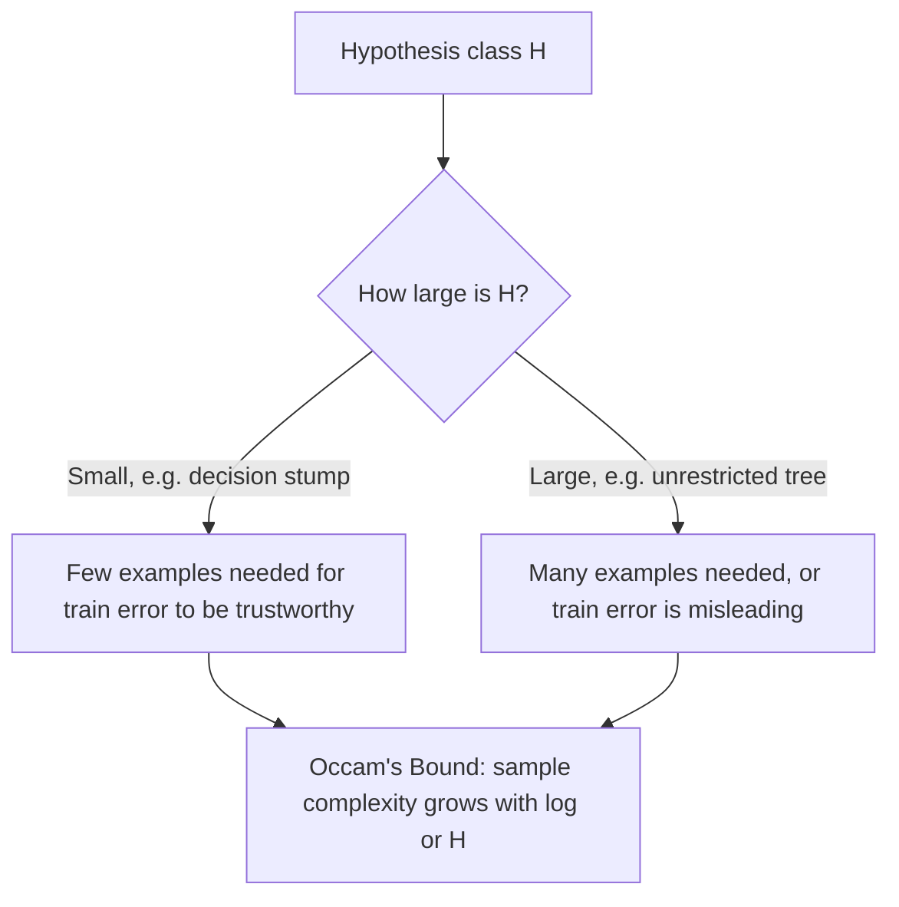

# Chapter 9: Learning Theory

> Simple functions generalize well — and now we can actually prove it, not just believe it.

**Type:** Learn + Build **Languages:** Python **Prerequisites:** Chapter 1 (Decision Trees), Chapter 3 (The Perceptron) **Time:** ~45 minutes
**Source:** A Course in Machine Learning, Hal Daumé III — Chapter 10

## Learning Objectives
- Explain why perfect, always-correct induction is provably impossible, and what "Probably Approximately Correct" (PAC) means instead.
- Implement the "Throw Out Bad Terms" algorithm for PAC-learning boolean conjunctions and empirically verify its (ε, δ) behavior.
- Demonstrate the VC dimension of linear classifiers in 2D by testing which point sets can and cannot be shattered.
- Explain Occam's Razor as a formal sample-complexity statement, not just a philosophical preference for simplicity.
- Recognize the difference between driving training error to zero and achieving low test error.

## The Problem
Every algorithm in this course generalizes from a finite training sample to unseen data — but *why* should that ever work, and how many examples does it actually take? This chapter turns "simple models generalize better" from an intuition into a theorem. There are two central ideas: (1) since a learner only ever sees a random sample, it can never be perfect every time — the best you can hope for is that it's *usually* *close to* correct (PAC learning); and (2) the size of your hypothesis class directly controls how many examples you need before you can trust that low training error implies low test error (Occam's Razor, VC dimension).

## The Concept



- **Induction can't be perfect**: with label noise, or simply because your sample is finite and random, no algorithm can guarantee zero error on every possible training set. PAC learning formalizes the realistic goal instead: an (ε, δ)-PAC algorithm returns a function with error at most ε, with probability at least 1−δ.
- **Occam's Razor as a theorem**: if a learner always fits the training data perfectly and its hypothesis class H is finite, the number of examples needed to guarantee low test error grows only with `log|H|` — not `|H|` itself. Simpler (smaller) hypothesis classes need dramatically fewer examples.
- **VC dimension handles infinite hypothesis classes**: instead of counting hypotheses, you measure how many points the class can "shatter" (fit under every possible labeling). Linear classifiers in the plane can shatter any 3 points but never all labelings of 4 — so their VC dimension is exactly 3.
- **Zero training error is not the goal**: an unbounded model (e.g., a fully-grown decision tree) can always reach 100% training accuracy, but that number tells you nothing about test performance. What matters is the gap between the two, and how quickly that gap closes as you add data.

## Build It

**1. PAC-learning a boolean conjunction — "Throw Out Bad Terms"** (Algorithm 10.4):

```python
def binary_conjunction_train(X, y):
    surviving = {(d, v) for d in range(D) for v in (0, 1)}  # every possible literal
    for xi, yi in zip(X, y):
        if yi == 1:                       # only positive examples eliminate literals
            for d in range(D):
                surviving.discard((d, 1 - xi[d]))
    return surviving
```

**2. Testing whether a point set can be shattered by a linear classifier** (Section 10.6):

```python
for labels_bits in range(2 ** n):           # try every possible binary labeling
    y = ...
    clf = Perceptron().fit(points, y)
    if not np.array_equal(clf.predict(points), y):
        return False                        # this labeling defeated every line
```

**Run it:**
```bash
python3 learning_theory.py
```

**Expected output (abridged, real run):**
```
EXPERIMENT A: PAC-learning a boolean conjunction (Algorithm 10.4)
 N (train size) | mean test err | P(err > 0.05)
               5 |        0.0699 |        1.0000
              80 |        0.0507 |        0.5650
             300 |        0.0014 |        0.0000

EXPERIMENT B: VC dimension of linear classifiers in the plane
Can a linear classifier shatter 3 points (triangle)?  True
Can a linear classifier shatter 4 points (unit square)? False
  Counter-example labeling that fails: [0 1 1 0]  (the XOR pattern)

EXPERIMENT C: Occam's Razor -- decision stump vs unrestricted tree
    N | stump train | stump test |  full-tree train |  full-tree test
   10 |      1.0000 |     0.6901 |           1.0000 |          0.6901
  398 |      0.9271 |     0.9123 |           1.0000 |          0.9181
```
Experiment A shows the (ε, δ)-PAC guarantee directly: as the sample size N grows from 5 to 300, both the mean test error and the probability of a "bad" run (error above 5%) collapse toward zero. Experiment B reproduces the classic VC-dimension-3 result for linear classifiers in the plane using a real (if minimal) perceptron, not just a diagram. Experiment C shows something more subtle and honest: the unrestricted decision tree reaches 100% training accuracy at *every* sample size, while the decision stump's training accuracy actually degrades as N grows (it runs out of room to fit more points with a single split) — the persistent train/test gap for the full tree is exactly the symptom Occam's Bound warns about in a hypothesis class large enough to memorize anything.

## Use It

| API / Function | When to use it |
|---|---|
| `binary_conjunction_train(X, y)` | Illustrative only — real problems rarely have a noise-free boolean conjunction as their true concept, but the algorithm is the cleanest possible illustration of PAC convergence. |
| `can_shatter(points)` | A didactic tool for building intuition about VC dimension; not something you'd run on production data. |
| Learning curves (train/test accuracy vs. N) | The practical, everyday tool this chapter justifies theoretically — always plot this before trusting a complex model on limited data. |
| `max_depth` / other capacity hyperparameters | The practical lever for controlling `|H|`, directly connecting back to Occam's Bound. |

## Exercises
1. Re-run Experiment A with a *noisy* ground-truth concept (flip 5% of labels at random) and observe how the PAC guarantee degrades — does the algorithm ever converge to zero error?
2. Compute the actual VC dimension of axis-aligned rectangles in 2D by extending `can_shatter` — how many points can be shattered?
3. In Experiment C, add irrelevant random noise features to the dataset and re-run the learning curves — does the gap between the stump and the full tree get worse, matching the "irrelevant features" discussion from Chapter 4?

## Key Terms

| Term | Common Assumption | Precise Meaning |
|---|---|---|
| PAC Learning | "The algorithm always works" | A guarantee that an algorithm returns a low-error (ε) hypothesis with high probability (1−δ), not that it is always low-error. |
| Occam's Razor | "Prefer simple explanations, philosophically" | A formal theorem: for a finite hypothesis class that fits training data perfectly, sample complexity scales with `log|H|`. |
| VC Dimension | "How complex a model looks" | The largest number of points a hypothesis class can shatter — i.e., fit under every possible labeling — used to measure the capacity of infinite hypothesis classes. |
| Sample Complexity | "How much data you happen to have" | The number of training examples an algorithm formally requires to guarantee a target error rate with a target confidence. |
