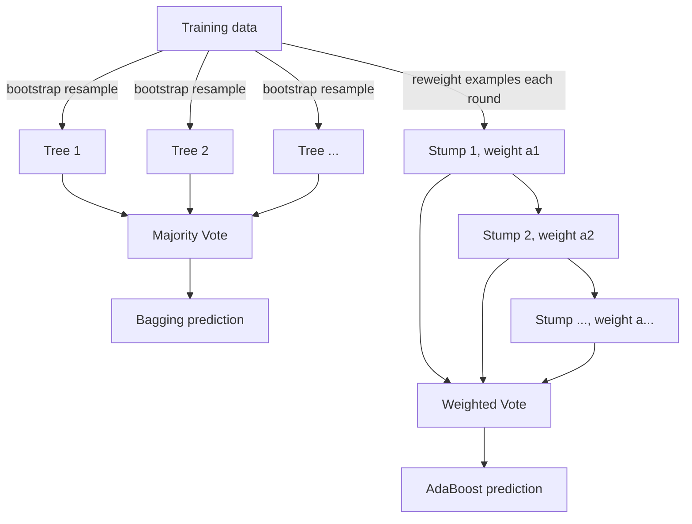

# Chapter 10 (Day 10): Ensemble Methods + Efficient Learning

> A crowd of weak, biased learners can out-predict any single expert — if you know how to weight their votes.

**Type:** Learn + Build **Languages:** Python **Prerequisites:** Chapter 1 (Decision Trees) **Time:** ~55 minutes
**Source:** A Course in Machine Learning, Hal Daumé III — Chapters 11 (Ensemble Methods) & 12 (Efficient Learning)

## Learning Objectives
- Implement bagging and explain how it reduces the variance of an overfit base learner.
- Implement AdaBoost from scratch and explain the difference between a weak learner and a strong learner.
- Implement a random forest (bootstrap + random feature subsets) and compare it to bagging.
- Implement stochastic gradient descent (SGD) and contrast it with full-batch gradient descent.
- Implement feature hashing and explain the memory/accuracy trade-off it introduces.

## The Problem
A single decision tree, grown fully, tends to overfit; a single decision stump (depth 1) badly underfits. Rather than searching for one "just right" model, ensemble methods combine many mediocre or biased models so that their combined vote is better than any individual member. Separately, once datasets get large (millions of rows, thousands of features), looking at the *entire* dataset before taking a single gradient step (as in Chapter 6's gradient descent) becomes wasteful — this chapter also covers how to learn from a *stream* of examples instead.

## The Concept



- **Bagging** trains the *same* model type on different bootstrap resamples of the data, then votes. It mainly reduces **variance** — great for models (like deep trees) that are individually unstable/overfit.
- **AdaBoost** trains a sequence of *weak* learners (each barely better than 50% accuracy), where each round up-weights the examples the previous rounds got wrong. The final prediction is a weighted vote, with weight `alpha_k = 0.5 * log((1-err_k)/err_k)` per round — better rounds get louder votes.
- **Random Forest** adds a second source of randomness on top of bagging: each tree only gets to see a random subset of the *features*, which decorrelates the trees further.
- **SGD** replaces "compute the gradient over all N examples" with "compute the gradient over 1 (or a small batch of) randomly-drawn example(s)," using a shrinking learning rate `eta_k = eta_0 / sqrt(k)`. Each step is `O(D)` instead of `O(ND)`.
- **Feature hashing** maps a huge/unknown feature space down to a fixed size `P` using a hash function, trading a small amount of accuracy (from collisions) for a fixed, small memory footprint.

## Build It

**1. A decision stump (the weak learner for AdaBoost).** Just a 1-level decision tree that picks the single best (feature, threshold, sign) under *weighted* error:

```python
for d in range(D):
    for thresh in candidate_thresholds:
        for polarity in (1, -1):
            pred = np.where(polarity * (col - thresh) >= 0, 1, -1)
            err = np.sum(sample_weight[pred != y])
```

**2. AdaBoost's reweighting step (Algorithm 11.2 in the book):**

```python
eps = np.clip(np.sum(d[pred != y]), 1e-10, 1 - 1e-10)
alpha = 0.5 * np.log((1 - eps) / eps)
d = d * np.exp(-alpha * y * pred)
d = d / d.sum()
```

**3. Bagging's bootstrap loop:**

```python
for _ in range(self.n_estimators):
    idx = rng.randint(0, N, size=N)   # sample WITH replacement
    tree = DecisionTreeClassifier().fit(X[idx], y[idx])
```

**4. Random Forest adds random feature subsets on top:**

```python
feat_idx = rng.choice(D, size=int(np.sqrt(D)), replace=False)
tree.fit(X[idx][:, feat_idx], y[idx])
```

**5. SGD with a decaying learning rate (Chapter 12):**

```python
for epoch in range(epochs):
    perm = rng.permutation(N)          # re-permute every epoch!
    for start in range(0, N, batch_size):
        step += 1
        g = grad(w, X[batch], y[batch])
        eta = lr0 / np.sqrt(step)
        w -= eta * g
```

**Run it:**
```bash
python3 ensemble_efficient.py
```

**Expected output (abridged, real run on Breast Cancer Wisconsin, 30 features):**
```
EXPERIMENT A: AdaBoost from scratch vs sklearn AdaBoostClassifier
From-scratch AdaBoost (50 stumps) test accuracy : 0.9720
sklearn AdaBoostClassifier      test accuracy : 0.9650

EXPERIMENT B: Bagging from scratch vs sklearn BaggingClassifier
Single (unbagged) decision tree test accuracy : 0.9371
From-scratch Bagging (25 trees) test accuracy : 0.9580
sklearn BaggingClassifier       test accuracy : 0.9510

EXPERIMENT C: Random Forest from scratch vs sklearn RandomForestClassifier
From-scratch Random Forest test accuracy : 0.9510
sklearn RandomForestClassifier test accuracy : 0.9580

EXPERIMENT D: Boosting depth vs #rounds
 #rounds |  test acc
       1 |    0.9231
       5 |    0.9580
      50 |    0.9720
     100 |    0.9720

EXPERIMENT E: SGD vs full-batch Gradient Descent
Full-batch GD  (200 full-dataset sweeps): acc=0.9720, time=12.71 ms
Stochastic GD  (10 epochs, batch size 1): acc=0.9650, time=93.70 ms

EXPERIMENT F: Feature Hashing -- memory vs accuracy
 P (hashed dim) |  test acc
              5 |    0.9161
             10 |    0.9441
             20 |    0.9650
             30 |    0.9790
```
The from-scratch AdaBoost, Bagging, and Random Forest all land within a percentage point or two of their scikit-learn counterparts. Experiment D confirms the book's central claim about boosting: a single depth-1 stump barely beats chance (92%), but 50-100 boosted stumps reach 97%+. Experiment E shows an honest, non-cherry-picked result: on this *small* dataset (569 rows), vectorized batch GD is actually faster in wall-clock time than a pure-Python SGD loop — SGD's real advantage only shows up at a scale where a full pass over the data is itself expensive. Experiment F shows the accuracy you give up by hashing 30 real features down into a smaller table.

## Use It

| API / Function | When to use it |
|---|---|
| `AdaBoostFromScratch(n_rounds)` | When you have a cheap weak learner (e.g., decision stumps) and want to combine many of them into a strong classifier. |
| `BaggingFromScratch(n_estimators, max_depth)` | When your base model (e.g., a deep tree) is individually high-variance/overfit, and you want to average that variance away. |
| `RandomForestFromScratch(n_estimators, max_features)` | Same as bagging, but you also want to decorrelate trees by restricting each to a random feature subset. |
| `train_sgd(X, y, lam, epochs, batch_size)` | Very large datasets, streaming data, or when a full pass over the data before any update is too slow/expensive. |
| `train_batch_gd(X, y, lam, iters)` | Small-to-medium datasets that fit comfortably in memory, where exact gradients are cheap. |
| `hash_features(X, P)` | Huge or unbounded feature spaces (e.g., text n-grams) where you need a fixed memory budget. |

## Exercises
1. Modify `AdaBoostFromScratch` to print the *cumulative* weighted vote margin `y * decision_function(x)` for the 5 hardest training examples after 50 rounds — do they ever get "fixed," or does AdaBoost keep struggling with the same points?
2. Add L1 (sparse) regularization with truncated-gradient updates (Section 12.3) to `train_sgd`, and measure how many weights become exactly zero as you vary the regularization strength.
3. Modify `hash_features` to use a *signed* hash (Section 12.4's `[h(d)=p]` variant with a random +1/-1 sign per feature) and check whether it reduces the accuracy loss from collisions compared to the unsigned version used here.

## Key Terms

| Term | Common Assumption | Precise Meaning |
|---|---|---|
| Weak Learner | "It's basically useless on its own" | A classifier only guaranteed to beat 50% accuracy by a small margin; AdaBoost provably turns any such learner into an arbitrarily accurate one, given enough rounds. |
| Bagging | "Just training on random subsets" | Training on *bootstrap* resamples (same size N, drawn with replacement) specifically to reduce variance while leaving bias roughly unchanged. |
| Stochastic Gradient Descent | "A noisier, worse version of gradient descent" | A principled optimizer for the *expected* loss over a data distribution, using single-example (or small-batch) gradient estimates and a carefully decaying step size for guaranteed convergence. |
| Feature Hashing | "A hack for compressing features" | A random linear projection `phi: R^D -> R^P` that is mathematically equivalent to adding a small, near-zero-mean quadratic kernel term to your model. |
