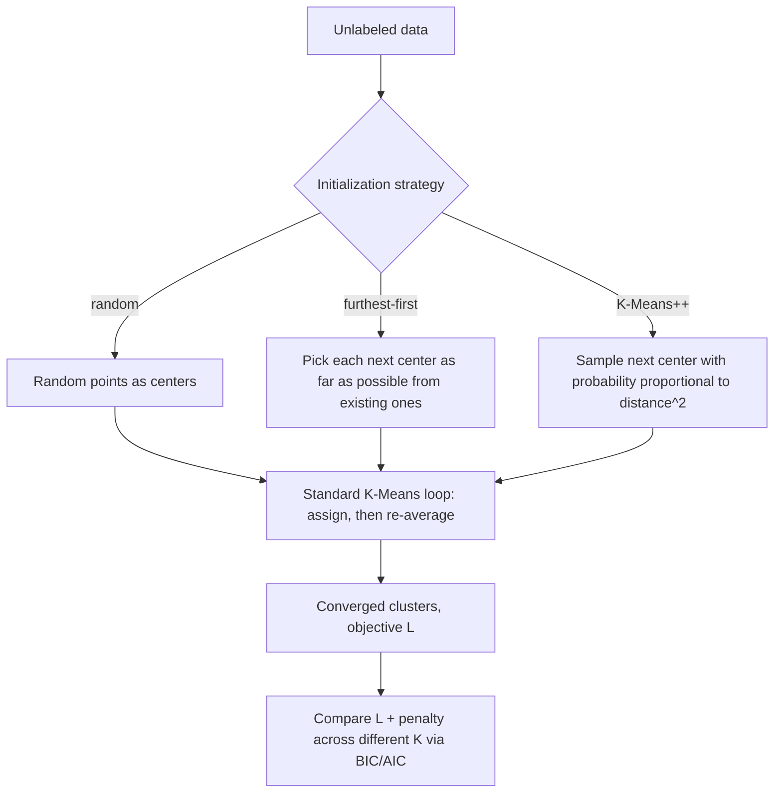

# Chapter 11 (Day 11): Unsupervised Learning

> When nobody hands you labels, geometry is the only teacher you have left.

**Type:** Learn + Build **Languages:** Python **Prerequisites:** Chapter 2 (Geometry & Nearest Neighbors) **Time:** ~50 minutes
**Source:** A Course in Machine Learning, Hal Daumé III — Chapter 13

## Learning Objectives
- Explain the K-Means objective function `L(z, mu)` and why the algorithm is guaranteed to converge.
- Implement the furthest-first heuristic and K-Means++ initialization, and explain why initialization matters so much.
- Use the Bayes/Akaike Information Criteria (BIC/AIC) to choose the number of clusters K.
- Implement PCA from scratch via eigendecomposition of the data covariance matrix.
- Relate the "maximize variance" view of PCA to the "minimize reconstruction error" view, and confirm they're the same objective.

## The Problem
Chapter 2 introduced K-Means as a quick way to group unlabeled data, but glossed over two practical headaches: (1) K-Means is very sensitive to how its cluster centers are initialized, and can converge to a bad local optimum; (2) nobody tells you what K should be. Separately, high-dimensional data (like 8x8-pixel digit images, 64 raw features) is hard to visualize or work with directly — dimensionality reduction techniques like PCA let you compress data down to a handful of axes while keeping as much of the signal as possible.

## The Concept



- **K-Means always converges** (Theorem 15 in the book) because both of its steps — reassigning points, and recomputing means — can only decrease (never increase) the objective `L = sum of squared distances to assigned center`, and `L` is lower-bounded by zero.
- **It only converges to a *local* optimum.** This is why initialization matters: a bad starting guess can trap the algorithm in a mediocre clustering.
- **Furthest-first** and **K-Means++** are both ways to spread out the initial centers instead of picking them uniformly at random. K-Means++ adds randomness (sampling proportional to distance-squared) so that it comes with a provable `O(log K)`-approximation guarantee to the optimal clustering.
- **BIC and AIC** both answer "is it worth going from K-1 to K clusters?" by penalizing the objective with a term that grows with K (and with the dimensionality D) — more clusters always lower the raw objective, so you need a penalty to avoid picking K = N.
- **PCA** finds the direction(s) of maximum variance in the data. Equivalently (and this is provable via a few lines of algebra, see Eq. 13.14-13.18 in the book), it finds the direction(s) that *minimize the squared reconstruction error* if you projected the data down and then projected it back up.

## Build It

**1. Furthest-first heuristic** — greedily pick the point farthest from all previously chosen centers:

```python
min_dist = np.linalg.norm(X - centers[0], axis=1) ** 2
for k in range(1, K):
    next_idx = np.argmax(min_dist)
    centers[k] = X[next_idx]
    min_dist = np.minimum(min_dist, np.linalg.norm(X - centers[k], axis=1) ** 2)
```

**2. K-Means++** — same idea, but *sample* proportional to squared distance instead of taking the max:

```python
probs = min_dist / min_dist.sum()
next_idx = rng.choice(N, p=probs)
```

**3. BIC / AIC for choosing K (Eq. 13.2-13.3 in the book):**

```python
bic = L + K * np.log(D)
aic = L + 2 * K * D
```

**4. PCA via covariance eigendecomposition (Section 13.2):**

```python
Xc = X - X.mean(axis=0)
cov = (Xc.T @ Xc) / (Xc.shape[0] - 1)
eigvals, eigvecs = np.linalg.eigh(cov)
order = np.argsort(eigvals)[::-1]
components = eigvecs[:, order][:, :n_components].T
```

**Run it:**
```bash
python3 unsupervised_learning.py
```

**Expected output (abridged, real run):**
```
EXPERIMENT A: initialization matters -- random vs furthest-first vs K-Means++
     init method |  mean L (10 runs) |  mean ARI
          random |           1310.23 |    0.8397
  furthest-first |           1310.61 |    0.8288
        kmeans++ |           1280.69 |    0.8699

EXPERIMENT B: from-scratch K-Means++ vs sklearn's KMeans
From-scratch K-Means++  : L=1282.46, ARI=0.8456
sklearn KMeans          : L=1277.93, ARI=0.8975

EXPERIMENT C: choosing K via BIC / AIC
   K |  L (inertia) |        BIC |          AIC
   1 |      2314.00 |    2316.56 |      2340.00
   2 |      1658.76 |    1663.89 |      1710.76
   3 |      1277.93 |    1285.62 |      1355.93  <-- true K=3
   4 |      1186.64 |    1196.90 |      1290.64

EXPERIMENT D: PCA from scratch vs sklearn.decomposition.PCA (Digits dataset, 64 features)
Cumulative variance explained by 10 components: mine=0.7382, sklearn=0.7382
Per-component |correlation| between my projection and sklearn's: min=1.0000, mean=1.0000

EXPERIMENT E: reconstruction error vs number of components
 K components |  reconstruction err | cum. var. explained
            1 |           1022.5714 |              0.1489
           10 |            314.5150 |              0.7382
           64 |              0.0000 |              1.0000
```
On the Wine dataset (178 samples, 13 features, 3 known cultivars), K-Means++ beats both random and furthest-first initialization on average, and the BIC/AIC table shows the objective's steep drop flattening out right around the true K=3. On the Digits dataset (1797 images, 64 pixel features), the from-scratch PCA matches scikit-learn's PCA exactly in explained variance ratio, and the per-component correlation of 1.0000 confirms the two implementations recover identical principal axes (up to sign). Experiment E empirically verifies the book's claim that reconstruction error goes to exactly zero as the number of components reaches the full dimensionality.

## Use It

| API / Function | When to use it |
|---|---|
| `kmeans_fit(X, K, init="kmeans++")` | Standard unsupervised grouping of numeric data into roughly round clusters. |
| `furthest_first_init` | A cheap, deterministic way to spread out initial centers when you want reproducibility without randomness. |
| `bic_aic(X, K, L)` | Model-selection step to pick a reasonable K instead of guessing. |
| `PCAFromScratch(n_components).fit_transform(X)` | Compress high-dimensional numeric data before visualization, clustering, or as a regularizing pre-processing step for supervised learning. |
| `sklearn.cluster.KMeans(init="k-means++", n_init=10)` | Production clustering — includes multiple random restarts automatically. |
| `sklearn.decomposition.PCA` | Production dimensionality reduction — uses efficient SVD-based solvers for large data. |

## Exercises
1. Extend the BIC/AIC experiment to plot `L` itself (without any penalty) as a function of K, from K=1 to K=20, and confirm it keeps decreasing monotonically even well past the "true" K=3 — this is exactly the overfitting risk BIC/AIC are designed to guard against.
2. Modify `PCAFromScratch` to also report reconstruction error using the *first* principal component only, then compare it to using a random (non-optimal) unit direction — by how much does PCA outperform a random projection?
3. Implement one more initialization strategy: run K-Means from 20 different random restarts and keep only the clustering with the lowest final `L`. Compare its mean ARI on the Wine dataset to the K-Means++ single-run result above.

## Key Terms

| Term | Common Assumption | Precise Meaning |
|---|---|---|
| K-Means Convergence | "It finds the best clustering" | A guarantee that the objective `L` never increases and therefore the algorithm halts in finite steps — with no guarantee it reaches the *global* minimum. |
| K-Means++ | "Just a fancier random initialization" | A specific probability-proportional-to-distance-squared sampling scheme that carries a formal `O(log K)`-approximation guarantee versus the optimal clustering. |
| BIC / AIC | "A formula that tells you the right K" | A penalized-likelihood heuristic for model selection; it trades off fit quality against model complexity, but doesn't guarantee the "true" K if the data doesn't actually contain clean clusters. |
| Principal Component Analysis | "Just picks the 2 most important original features" | A *linear combination* of all original features, chosen so that projecting the data onto it captures the maximum possible variance (equivalently, minimizes squared reconstruction error). |
