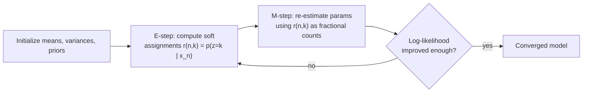

# Chapter 14: Expectation Maximization

> When your labels go missing, don't throw away the data — treat the labels as unknowns and let the model guess them, again and again, until it stops changing its mind.

**Type:** Learn + Build **Languages:** Python **Prerequisites:** Chapter 7 (Probabilistic Modeling) **Time:** ~40 minutes
**Source:** A Course in Machine Learning, Hal Daumé III — Chapter 14

## Learning Objectives
- Explain the relationship between model parameters and hidden variables.
- Construct a generative story for clustering with a mixture of Gaussians.
- Derive the E-step and M-step update equations from the generative story.
- Implement full EM for Gaussian Mixture Models and verify the log-likelihood never decreases.
- Contrast EM's soft cluster assignments with K-Means' hard assignments.

## The Problem
Suppose you believe your data was generated by a mixture of Gaussian "blobs," but you don't know which blob generated which point (no labels). If you *did* know the labels, estimating each blob's mean, variance, and prior probability would be simple maximum-likelihood counting (Chapter 7). Since the labels are hidden, you have a chicken-and-egg problem: knowing the labels would let you estimate the Gaussians, and knowing the Gaussians would let you estimate the labels. Expectation Maximization (EM) breaks this cycle through iteration.

## The Concept



- **Soft vs. hard assignment**: unlike K-Means, which assigns each point 100% to one cluster, EM keeps a full probability distribution `r(n,k)` over clusters for every point.
- **The M-step is just weighted MLE**: the formulas for updating the mean, variance, and prior are *identical* to the fully-labeled case, except `[y_n = k]` is replaced by the expected value `r(n,k)`.
- **Guaranteed improvement, not guaranteed optimum**: EM provably never decreases the log-likelihood lower bound each iteration, but like K-Means it can get stuck in a local optimum — random restarts are the standard fix.
- **EM subsumes K-Means**: if you force `r(n,k)` to be a hard 0/1 assignment instead of a soft probability, and force all covariances to be spherical, EM's update equations collapse into the K-Means algorithm from Chapter 2.

## Build It

**1. E-step — compute responsibilities.** For every point and every cluster, compute how likely that cluster is to have generated it, then normalize across clusters:

```python
weighted[:, k] = theta[k] * gaussian_pdf(X, means[k], covs[k])
r = weighted / weighted.sum(axis=1, keepdims=True)
```

**2. M-step — re-estimate parameters from fractional counts.** This mirrors the labeled-data MLE formulas exactly, with `r[:, k]` playing the role of `[y_n = k]`:

```python
Nk = r[:, k].sum()
means[k] = (r[:, k, None] * X).sum(axis=0) / Nk
covs[k]  = (r[:, k, None, None] * outer(diff, diff)).sum(axis=0) / Nk
theta[k] = Nk / N
```

**3. Track the log-likelihood lower bound** every iteration to confirm convergence, and use multiple random restarts to avoid a bad local optimum (the book's own advice from the K-Means chapter applies here too).

**Run it:**
```bash
python3 em_semisupervised.py
```

**Expected output (Part A, real run on the Iris dataset):**
```
PART A: EM for Gaussian Mixture Models on the real Iris dataset
Dataset: 150 examples, 4 features, 3 true species

--- Monotonic increase of the EM log-likelihood lower bound ---
   log-likelihood = -642.1867
   log-likelihood = -457.8642
   log-likelihood = -428.4472
   ...
   log-likelihood = -290.5311
   log-likelihood = -290.5311
   log-likelihood = -290.5311
Log-likelihood monotonically non-decreasing across iterations: True

--- Clustering quality vs true species labels (Adjusted Rand Index) ---
From-scratch EM GMM : 0.9039
sklearn GaussianMixture : 0.9039
Converged in 52 EM iterations (from-scratch)
```
With 10 random restarts (matching the book's advice to always restart EM/K-Means multiple times), the from-scratch implementation reaches the *exact same* clustering quality as `sklearn.mixture.GaussianMixture` on real flower-measurement data, and the log-likelihood is confirmed to never decrease — the theoretical guarantee of the EM lower-bound argument holding up empirically.

## Use It

| API / Function | When to use it |
|---|---|
| `GMMFromScratch(k).fit(X)` | Soft/probabilistic clustering when clusters may overlap or have different shapes/sizes. |
| `.loglik_history_` | Diagnostic: verify convergence and compare quality across random restarts. |
| `.r_` (responsibility matrix) | When you need per-point cluster probabilities, not just a hard label. |
| `sklearn.mixture.GaussianMixture` | Production use — has smarter initialization (k-means++) and numerically stable covariance handling. |

## Exercises
1. Force all covariance matrices to be diagonal (only fit variances, not full covariance) and compare clustering quality and runtime to the full-covariance version.
2. Modify the M-step so `r(n,k)` is hardened to `argmax` before updating parameters (i.e., hard EM). Confirm this reproduces K-Means-like behavior and measure how much clustering quality changes.
3. Plot the log-likelihood curve across iterations for 5 different random seeds and identify how many restarts are typically needed to reach the best local optimum on this dataset.

## Key Terms

| Term | Common Assumption | Precise Meaning |
|---|---|---|
| Expectation Maximization | "It finds the globally best clustering" | An iterative algorithm that provably increases a lower bound on the log-likelihood each round, converging only to a *local* optimum that depends on initialization. |
| Responsibility (`r(n,k)`) | "Just a soft label" | The posterior probability `p(z_n = k \| x_n)` under the current model — literally how much of point `n`'s "weight" is assigned to cluster `k` in the next M-step. |
| E-step | "The hard part" | The cheap step: given fixed parameters, compute posterior probabilities over hidden variables in closed form. |
| M-step | "The easy part" | Ordinary weighted maximum-likelihood estimation, using the E-step's soft assignments as fractional counts. |
