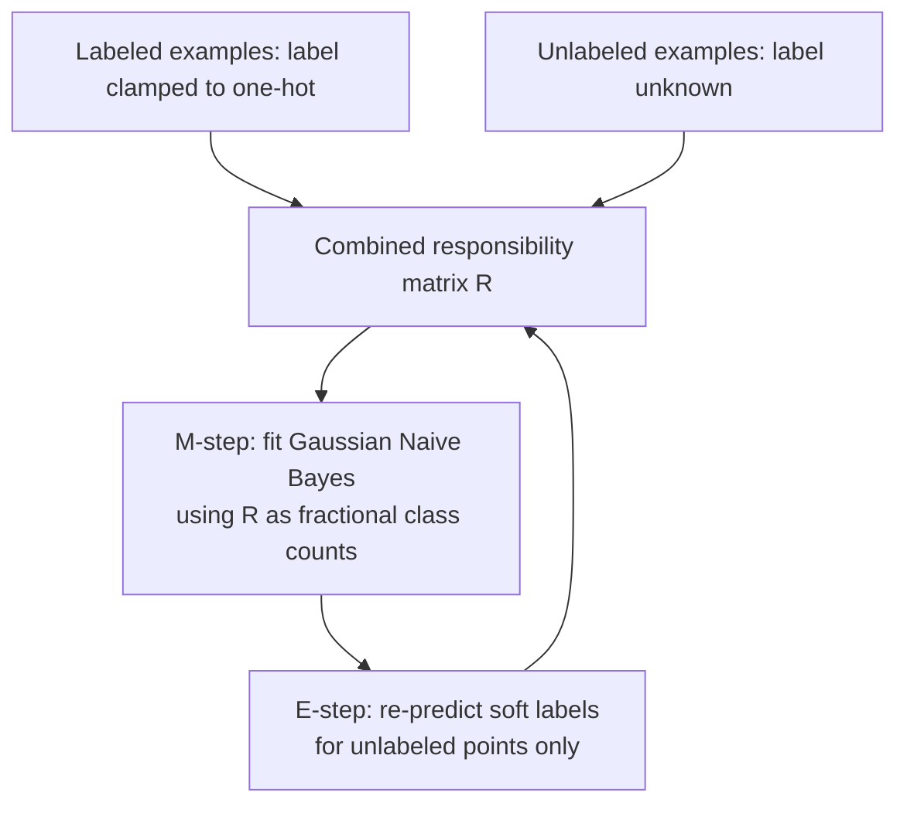

# Chapter 15: Semi-Supervised Learning

> Labels are expensive; data is cheap. If you already believe in a generative model, unlabeled examples can still tell you a lot about where the decision boundary should go.

**Type:** Learn + Build **Languages:** Python **Prerequisites:** Chapter 14 (Expectation Maximization), Chapter 7 (Probabilistic Modeling) **Time:** ~35 minutes
**Source:** A Course in Machine Learning, Hal Daumé III — Chapter 15

## Learning Objectives
- Explain the cluster assumption underlying semi-supervised discriminative learning and why it is necessary.
- Derive an EM algorithm for generative semi-supervised classification by treating missing labels as hidden variables clamped for labeled points.
- Quantify how much unlabeled data helps as a function of how much labeled data is available.
- Recognize when semi-supervised learning can hurt rather than help.

## The Problem
You have a small labeled dataset and a much larger pool of unlabeled examples from the same distribution. Throwing away the unlabeled data feels wasteful — surely the *shape* of the unlabeled data (where the clusters of points are) carries information about where the true decision boundary lies, even without labels attached. Section 15.1 of the book shows how to formalize this intuition using exactly the EM machinery from Chapter 14.

## The Concept



- **Labels become hidden variables**: for every unlabeled point, EM maintains a soft guess `r(n,k) = p(y_n = k | x_n)`, exactly as in Chapter 14, but for *labeled* points the responsibility is clamped to the true one-hot label and never updated.
- **The M-step doesn't change**: it is still ordinary weighted maximum-likelihood estimation of the generative Gaussian Naive Bayes classifier (Chapter 7), just fed a mix of hard (labeled) and soft (unlabeled) responsibilities.
- **The cluster assumption is doing the work**: this approach only helps if the true classes really do correspond to separated density clusters in feature space — if that assumption is wrong, unlabeled data can *actively mislead* the model (Section 15.5, "Dangers of Semi-Supervised Learning").
- **Diminishing returns**: the fewer labels you start with, the more unlabeled data helps; once you have "enough" labels, the supervised-only baseline nearly closes the gap on its own.

## Build It

**1. Build the combined responsibility matrix.** Labeled examples get a clamped one-hot row; unlabeled examples start uniform and get refined every iteration:

```python
R_lab = np.eye(n_classes)[y_lab]                    # clamped, never changes
R_unlab = np.full((N_unlab, n_classes), 1 / n_classes)  # initial guess
```

**2. Alternate E-step and M-step**, re-fitting the generative classifier on all data (labeled + currently-guessed unlabeled) and then refreshing only the unlabeled guesses:

```python
for _ in range(iters):
    R_all = np.vstack([R_lab, R_unlab])
    model.fit_soft(X_all, R_all)          # M-step
    R_unlab = model.predict_proba(X_unlab)  # E-step (labeled rows stay clamped)
```

**3. Compare three regimes**: a classifier trained on only the labeled slice, the EM semi-supervised classifier that also uses the unlabeled slice, and a reference classifier trained with *all* true labels (the best-case upper bound).

**Run it:**
```bash
python3 em_semisupervised.py
```

**Expected output (Part B, real run on Breast Cancer Wisconsin data, averaged over 15 random splits per row):**
```
PART B: EM Semi-Supervised Learning on real Breast Cancer Wisconsin data

label frac | #labeled | sup-only acc |  EM semi-sup acc | full-label ref
------------------------------------------------------------------------
        2% |        7 |       0.6569 |           0.8593 |         0.9357
        5% |       19 |       0.9107 |           0.9146 |         0.9357
       10% |       39 |       0.9263 |           0.9181 |         0.9357
       25% |       99 |       0.9357 |           0.9189 |         0.9357

Averaged over the four low-label regimes, EM semi-supervised learning
beats the supervised-only classifier trained on the same labeled slice
by +0.0453 accuracy on average
```
The effect is dramatic with only 7 labeled points (2%): accuracy jumps from 65.7% to 85.9% just by also exploiting the unlabeled examples — nearly closing the gap to the 93.6% reference that uses every true label. As the labeled fraction grows, the supervised-only baseline catches up on its own and the benefit of the unlabeled data shrinks, exactly as the theory predicts.

## Use It

| API / Function | When to use it |
|---|---|
| `em_semi_supervised(X_lab, y_lab, X_unlab)` | Very few labels available, but a large pool of unlabeled examples from the same distribution and a reasonable generative model assumption. |
| `GaussianNBFromScratch.fit_soft(X, R)` | Any time you need to fit a generative classifier with fractional/soft labels instead of hard ones. |
| Supervised-only baseline | Sanity check — always compare against this to confirm the unlabeled data is actually helping, not hurting. |

## Exercises
1. Repeat the experiment with `n_classes` set to 3 (e.g. on the Iris or Wine dataset) and see whether the same low-label-regime benefit appears for a multi-class generative classifier.
2. Deliberately create a case where the cluster assumption is violated (e.g., shuffle a fraction of the unlabeled data's true structure) and observe EM semi-supervised learning degrade below the supervised-only baseline — this reproduces the "danger" discussed in Section 15.5.
3. Replace the Gaussian Naive Bayes generative model with a Bernoulli Naive Bayes model (Section 7.3) and adapt the semi-supervised EM loop for binary/count features.

## Key Terms

| Term | Common Assumption | Precise Meaning |
|---|---|---|
| Cluster Assumption | "Just means the data looks grouped" | The specific inductive bias that points in the same high-density region of feature space are likely to share the same label — the assumption that makes unlabeled data informative at all. |
| Clamped Responsibility | "Same as a normal soft label" | A responsibility vector fixed to a one-hot ground-truth label and *excluded* from the E-step update, distinguishing labeled from unlabeled points inside a single EM loop. |
| Semi-Supervised Learning | "Free extra labels" | Using unlabeled data to improve a model beyond what the labeled data alone would support, without ever inventing new ground-truth labels. |
