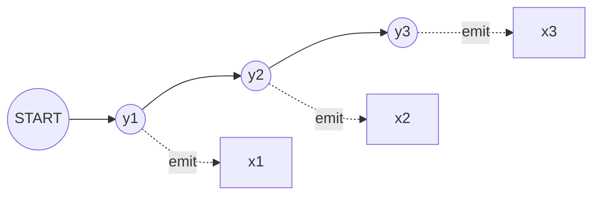

# Chapter 16: Graphical Models

> A prediction problem stops being "one label" and becomes a graph the moment your outputs depend on each other — a chain of words, a grid of pixels, a tree of syntax.

**Type:** Learn + Build **Languages:** Python **Prerequisites:** Chapter 5 (Beyond Binary Classification), Chapter 7 (Probabilistic Modeling) **Time:** ~40 minutes
**Source:** A Course in Machine Learning, Hal Daumé III — Chapter 16 (the chain-structured graphical model this chapter introduces is developed algorithmically in Chapter 18)

## Learning Objectives
- Describe why some prediction problems require modeling correlations between multiple outputs, not just one label at a time.
- Recognize a Hidden Markov Model (HMM) as a chain-structured graphical model: a sequence of hidden nodes connected to each other and to observed nodes.
- Derive the transition and emission probability estimates for an HMM as ordinary maximum-likelihood counting (same idea as Chapter 7's Naive Bayes).
- Implement the Viterbi algorithm as dynamic programming over the chain graph.
- Validate a dynamic-programming decoder against brute-force enumeration.

## The Problem
Section 5.4 of the book introduced *collective classification*: sometimes the labels you want to predict are correlated with each other, and predicting them independently gives poor results (recall the "jagged pixel mask" example from face detection). Graphical models formalize this by representing a prediction problem as a graph: vertices are input/output pairs, and edges encode the correlations you want your model to respect. The simplest, and most historically important, instance of this idea is a *chain*: predicting a sequence of tags (e.g., part-of-speech tags for a sentence) where each tag depends on its neighbor. This is exactly the Hidden Markov Model.

## The Concept



- **Two kinds of edges**: transition edges (tag → next tag) capture sequential structure; emission edges (tag → observed word) capture how hidden state generates observed data.
- **Training is just counting**: exactly like the Naive Bayes model of Chapter 7, both the transition and emission distributions have closed-form maximum-likelihood estimates — relative frequencies, with add-one smoothing to handle unseen words/transitions.
- **Decoding is dynamic programming, not brute force**: there are (number of tags)^(sentence length) possible tag sequences, far too many to enumerate for long sentences. The Viterbi algorithm exploits the chain structure to find the single best sequence in time linear in the sentence length.
- **Viterbi is the sequence analogue of DecisionTreeTest**: instead of walking down a tree structure making one decision at a time, Viterbi walks forward through time, at each step keeping only the best score achievable for ending in each possible hidden state — a direct generalization of "keep the best prefix" dynamic programming.

## Build It

**1. Count transitions and emissions (training = MLE, Section 7.2 again).** With Laplace smoothing to avoid zero probabilities for unseen word/tag combinations:

```python
trans = np.full((K + 1, K), alpha)   # +1 row for the START pseudo-state
emit = np.full((K, V), alpha)
for sent in sentences:
    prev = START_IDX
    for word, tag in sent:
        trans[prev, tag] += 1
        emit[tag, word] += 1
        prev = tag
log_trans = np.log(trans / trans.sum(axis=1, keepdims=True))
log_emit = np.log(emit / emit.sum(axis=1, keepdims=True))
```

**2. Viterbi decoding — forward pass keeping the best score per state, backward pass to recover the path:**

```python
score[0] = log_trans[START] + emit_col(words[0])
for t in range(1, T):
    for k in range(K):
        cand = score[t-1] + log_trans[:, k]
        back[t, k] = argmax(cand)
        score[t, k] = cand[back[t, k]] + emit_col(words[t])[k]
# backtrack from argmax(score[T-1]) using `back`
```

**3. Validate against brute force** on short sentences by literally enumerating every tag sequence and comparing scores — a sanity check that the dynamic program is correct before trusting it on longer inputs.

**Run it:**
```bash
python3 graphical_online.py
```

**Expected output (Part A, real run on a small hand-tagged English corpus):**
```
PART A: Hidden Markov Model + Viterbi decoding (Graphical Models)
Tiny hand-tagged English corpus: 15 sentences (11 train / 4 test), 6 tags
['ADJ', 'ADV', 'DET', 'NOUN', 'PRON', 'VERB'], 14 unique words

--- Correctness check: Viterbi vs brute-force enumeration ---
  the cat sleeps           viterbi=['DET', 'NOUN', 'VERB']  brute-force-optimal=['DET', 'NOUN', 'VERB']  match=True
  a small cat runs fast    viterbi=['DET', 'ADJ', 'NOUN', 'VERB', 'ADV']  brute-force-optimal=[...]  match=True
  he runs                  viterbi=['PRON', 'VERB']  brute-force-optimal=['PRON', 'VERB']  match=True

Viterbi always found the brute-force-optimal tag sequence: True

--- Tagging accuracy on held-out test sentences ---
Token-level tagging accuracy on held-out sentences: 14/15 = 0.933
```
Viterbi's dynamic-programming answer matches brute-force enumeration on every test sentence — confirming the decoder is exact, not approximate — and the trained HMM correctly tags 14 of 15 held-out tokens despite being trained on only 11 short sentences.

## Use It

| API / Function | When to use it |
|---|---|
| `HMM.fit(sentences)` | Any sequence-labeling task (POS tagging, named entity recognition, gene sequence annotation) where you have (observation, hidden-state) pairs for training. |
| `HMM.viterbi(words)` | Decoding: given a new observed sequence, find the single most probable hidden-state sequence. |
| Brute-force enumeration check | Whenever implementing a new dynamic-programming decoder, on short inputs, to catch indexing/off-by-one bugs before trusting it at scale. |

## Exercises
1. Add a fifth held-out test sentence containing a word never seen in training and confirm the `<UNK>` bucket / smoothing still produces a sensible tag sequence.
2. Extend the corpus with a new tag (e.g. `ADP` for prepositions) and a handful of new sentences, retrain, and re-run the brute-force validation check.
3. Modify `viterbi` to return not just the single best path but the top-2 best paths (a simple form of the more general k-best Viterbi algorithm).

## Key Terms

| Term | Common Assumption | Precise Meaning |
|---|---|---|
| Graphical Model | "A diagram, not really an algorithm" | A formal representation of a prediction problem as a graph of input/output vertices, where edges encode which outputs are assumed to be correlated — the graph structure directly determines what inference algorithm is tractable. |
| Hidden Markov Model | "Markov" just means simple | A chain graphical model where each hidden state depends only on the *immediately previous* hidden state (not the full history) — this specific independence assumption is exactly what makes exact dynamic-programming decoding tractable. |
| Viterbi Algorithm | "A greedy tagger" | An *exact* dynamic-programming algorithm that finds the single highest-probability hidden-state sequence, provably equivalent to brute-force enumeration but running in linear rather than exponential time. |
