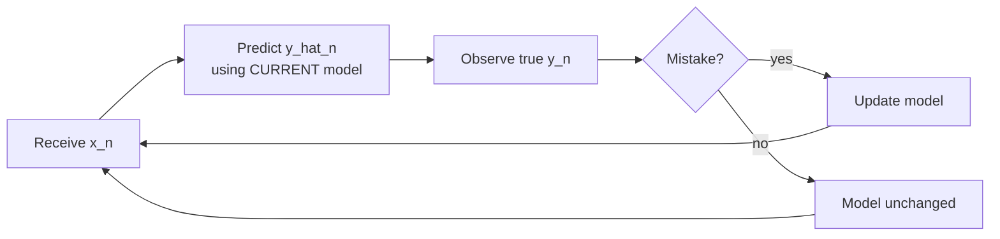

# Chapter 17: Online Learning

> There is no train/test split here — every example is a pop quiz you take before you're allowed to study it.

**Type:** Learn + Build **Languages:** Python **Prerequisites:** Chapter 3 (The Perceptron), Chapter 6 (Linear Models) **Time:** ~35 minutes
**Source:** A Course in Machine Learning, Hal Daumé III — Chapter 17

## Learning Objectives
- Explain why online learning is evaluated by mistake count / regret rather than train-vs-test accuracy.
- Implement the online Perceptron in the strict "predict-then-update" mistake-bound setting.
- Implement Follow-the-Leader (FTL) and understand why it requires re-solving an optimization problem every round.
- Implement Passive-Aggressive learning and explain its "smallest sufficient update" philosophy.
- Compare online learning algorithms by their cumulative mistake rate over a data stream.

## The Problem
All of the learning algorithms studied so far are *batch* algorithms: you get a full training set, train once, then evaluate on held-out test data. But imagine a course-recommendation system running live: students rate courses continuously, and the system must make a recommendation for each new student *before* seeing their true rating, then get to observe the true rating (or not) and improve. There is no natural "test set" — every prediction happens on data the model hasn't been updated on yet. Online learning formalizes this stream-based setting.

## The Concept



- **Predict before you update**: the defining rule of online learning — you are scored on every prediction *before* the corresponding label is used to improve the model, unlike batch training/testing.
- **Regret, not accuracy, is the metric**: the goal is not zero error (impossible with noisy or adversarial data) but low *regret* — doing nearly as well, in hindsight, as the best fixed model you could have chosen after seeing everything.
- **Three different "how much to change" philosophies**: the Perceptron updates by a fixed amount only on mistakes; Follow-the-Leader recomputes the globally optimal model on all data seen so far, every single round; Passive-Aggressive computes the *minimal* update that fixes the current margin violation, and does nothing at all when there is no violation ("passive" when correct, "aggressive" when wrong).
- **All three are online-hint-free**: none of them ever revisits a past example except through the current weight vector — a hard constraint that matters when data truly arrives as an unbounded stream.

## Build It

**1. Online Perceptron — predict-then-update, exactly as the mistake-bound analysis in the book assumes:**

```python
for xn, yn in stream:
    pred = sign(w @ xn)
    if pred != yn:
        mistakes += 1
        w = w + yn * xn         # perceptron update, ONLY on mistakes
```

**2. Follow-the-Leader — before each prediction, re-solve for the best model on everything seen so far** (using the closed-form ridge regression solution from Chapter 6):

```python
for xn, yn in stream:
    pred = sign(w @ xn)              # predict with the CURRENT leader
    Xs.append(xn); ys.append(yn)     # then reveal the true label
    w = solve(Xs.T @ Xs + lam*I, Xs.T @ ys)   # re-fit on ALL data so far
```

**3. Passive-Aggressive — smallest update that satisfies the margin constraint:**

```python
loss = max(0, 1 - yn * (w @ xn))
if loss > 0:
    tau = min(C, loss / (xn @ xn))
    w = w + tau * yn * xn
```

**Run it:**
```bash
python3 graphical_online.py
```

**Expected output (Part B, real run streaming the Breast Cancer Wisconsin dataset one example at a time):**
```
PART B: Online Learning on a real streamed Breast Cancer Wisconsin dataset
Streaming 569 examples one at a time, 30 features each

           algorithm |  total mistakes | mistake rate
-------------------------------------------------------
   Online Perceptron |              32 |       0.0562
   Follow-the-Leader |              29 |       0.0510
  Passive-Aggressive |              30 |       0.0527

--- Cumulative mistakes at checkpoints (regret over time) ---
 n examples seen | Perceptron |    FTL |     PA
              51 |          2 |      4 |      4
             151 |         12 |     10 |      7
             301 |         19 |     17 |     14
             569 |         32 |     29 |     30
```
All three algorithms end with a similar low mistake rate (~5%) despite never seeing the same example twice, confirming the "no-regret" intuition: the mistake *rate* keeps shrinking as more of the stream is processed.

**Correctness check against sklearn:**
```
From-scratch online Perceptron total mistakes : 32
sklearn SGDClassifier(loss='perceptron') mistakes (online, partial_fit): 27
```
The from-scratch implementation and `SGDClassifier` run in genuinely equivalent online, mistake-driven fashion via `partial_fit`; the small difference in mistake counts comes from sklearn's different learning-rate schedule, not a bug in either implementation.

## Use It

| API / Function | When to use it |
|---|---|
| `online_perceptron(X, y)` | Streaming binary classification when updates must be cheap (O(D) per example) and data may not be linearly separable in a static sense. |
| `follow_the_leader(X, y)` | Small-to-medium streams where re-solving a closed-form model every round is computationally affordable and you want the best possible model at every step. |
| `passive_aggressive(X, y, C)` | Streaming classification where you want the smallest possible update on each mistake (helpful when you don't want a single noisy example to overly perturb the model). |
| `sklearn.linear_model.SGDClassifier(...).partial_fit(...)` | Production streaming classification at scale, with configurable loss functions, regularization, and learning-rate schedules. |

## Exercises
1. Modify `follow_the_leader` to instead re-fit a *regularized logistic regression* each round (Section 6.2's logistic loss) rather than closed-form ridge regression, and compare mistake rates.
2. Tune the `C` hyperparameter of Passive-Aggressive across a range of values and plot how total mistakes change — connect this to the discussion of overfitting-vs-underfitting hyperparameters from Chapter 1.
3. Simulate a non-stationary stream (e.g., flip the sign of `y` halfway through the stream) and observe how quickly each of the three algorithms adapts — this probes their behavior outside the standard i.i.d. assumption.

## Key Terms

| Term | Common Assumption | Precise Meaning |
|---|---|---|
| Regret | "Just the error rate" | The difference between an online algorithm's cumulative loss and the cumulative loss of the best *fixed* model chosen in hindsight — a relative, not absolute, measure of performance. |
| Follow-the-Leader | "A leaderboard heuristic" | An online algorithm that, before each round, predicts using the model that would have exactly minimized total loss on all previously observed data — expensive per round, but a natural baseline for regret analysis. |
| Passive-Aggressive | "Aggressive means big updates" | An algorithm that makes *no* update when the current model already satisfies the margin constraint ("passive") and the *minimal sufficient* update when it doesn't ("aggressive"), never overshooting more than necessary. |
| Mistake Bound | "Same as training error" | A worst-case guarantee on the *total number* of mistakes an online algorithm can make over an entire (possibly adversarial) stream, independent of stream length in favorable cases (e.g., the Perceptron's margin-based bound from Chapter 3). |
