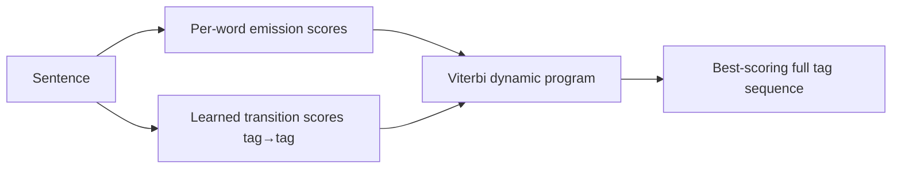

# Chapter 18: Structured Learning Tasks

> Some outputs aren't a single label — they're a whole sequence, and neighboring labels talk to each other.

**Type:** Learn + Build **Languages:** Python **Prerequisites:** Chapter 3 (The Perceptron) **Time:** ~40 minutes
**Source:** A Course in Machine Learning, Hal Daumé III — Chapter 18

## Learning Objectives
- Explain why predicting a sequence of correlated labels is fundamentally different from independent multiclass classification.
- Implement the Viterbi algorithm for exact decoding under emission + transition scores.
- Implement the structured perceptron: a direct generalization of the perceptron update (Chapter 3) to whole-sequence predictions.
- Measure how much accuracy "structure" actually buys you over an independent per-token classifier.
- Read off learned transition weights as a linguistically interpretable object.

## The Problem
Part-of-speech tagging is a natural example of *structured prediction*: given a sentence, assign one tag per word, but the tags are not independent — a determiner (`DET`) is virtually never followed by another determiner, but very often by a noun or adjective. If you classify each word independently (as in one-vs-all, Chapter 5), you throw away this correlation. Structured learning keeps a *score for entire output sequences*, combining per-word evidence with tag-to-tag transition preferences, and finds the best-scoring sequence efficiently with dynamic programming instead of enumerating all possible tag sequences.

## The Concept



- **Emission score**: how well a word's local features (the word itself, its suffix, position) match a candidate tag — this is exactly the linear scoring used in the perceptron (Chapter 3).
- **Transition score**: a learned preference for tag `t` following tag `t-1`, captured in a small `(K+1) × K` matrix (the `+1` row is a special "beginning of sentence" state).
- **Viterbi decoding**: instead of scoring `K^N` possible tag sequences for a sentence of length `N`, dynamic programming finds the optimal one in `O(N·K²)` time.
- **Structured perceptron update**: exactly like the ordinary perceptron ("if wrong, push weights toward the truth and away from the prediction" — Chapter 3, Algorithm 5), but applied to whole sequences: if the predicted sequence differs from the gold sequence, bump up emission/transition features seen in the gold sequence and bump down those seen in the (wrong) predicted sequence.

## Build It

**1. Emission features**, one linear scorer per word position, same style as Chapter 1/2's feature vectors:
```python
def emission_features(words, i):
    w = words[i]
    return [f"word={w}", f"suffix2={w[-2:]}", f"suffix3={w[-3:]}",
            f"is_first={i==0}", f"is_last={i==len(words)-1}",
            f"is_punct={w in '.,!?;'}"]
```

**2. Viterbi decoding** (the core dynamic program):
```python
V[0] = e0 + self.trans_w[self.BOS]
for i in range(1, N):
    candidates = V[i-1][:, None] + self.trans_w[:K, :]   # (K, K)
    back[i] = np.argmax(candidates, axis=0)
    V[i] = np.max(candidates, axis=0) + emit_scores(words, i)
```

**3. The structured perceptron update** — generalizing `w ← w + y·x` from Chapter 3 to sequences:
```python
def _update(self, words, gold, pred, lr=1.0):
    prev_gold, prev_pred = self.BOS, self.BOS
    for i in range(len(words)):
        gy, py = TAG2I[gold[i]], TAG2I[pred[i]]
        if gy != py or prev_gold != prev_pred:
            for f in emission_features(words, i):
                self.emit_w[f][gy] += lr
                self.emit_w[f][py] -= lr
            self.trans_w[prev_gold, gy] += lr
            self.trans_w[prev_pred, py] -= lr
        prev_gold, prev_pred = gy, py
```

**Run it:**
```bash
python3 structured_perceptron.py
```

**Expected output (real run, 30 genuinely hand-tagged English sentences, 80/20 split):**
```
Model                                 | token acc | sentence acc
Independent per-token (no structure)  |    0.7308 |       0.1667
Structured perceptron (+ Viterbi)     |    0.7692 |       0.3333

Learned transition preferences (top-3 'what comes after DET'):
  DET -> ADJ    weight=5.00
  DET -> NOUN   weight=1.00
  DET -> CONJ   weight=0.00
```
The structured model recovers a linguistically sound preference (a determiner is followed by an adjective or noun, essentially never a conjunction), and this structural knowledge translates directly into higher token- and sentence-level accuracy on unseen sentences, using the *exact same* emission features as the independent baseline. The only difference is that the structured model is allowed to reason about the whole sequence jointly instead of token-by-token.

## Use It

| API / Function | When to use it |
|---|---|
| `StructuredPerceptron().fit(data).predict(words)` | Any tagging/segmentation task where neighboring labels are correlated (POS tagging, NER, chunking). |
| `viterbi(words)` | Exact decoding whenever your score decomposes into emissions + pairwise transitions. |
| `IndependentTokenPerceptron` | Quick baseline / sanity check to quantify how much structure is actually helping. |
| `sklearn_crfsuite.CRF` (external) | Production-grade structured learning with L2/L1 regularization and richer feature templates. |

## Exercises
1. Add a "previous word" feature to `emission_features` and see whether token accuracy improves further.
2. Extend the transition matrix to second-order (condition on the *two* previous tags) and measure the accuracy/complexity trade-off.
3. Replace the perceptron loss with a margin-based (structured SVM style) update and compare convergence speed.

## Key Terms

| Term | Common Assumption | Precise Meaning |
|---|---|---|
| Structured prediction | "Just multiclass classification with more classes" | Predicting a *combinatorial* object (a sequence, tree, or graph of labels) whose parts are statistically dependent on each other. |
| Viterbi algorithm | "A special trick just for HMMs" | A general dynamic-programming method for finding the highest-scoring path through any chain-structured scoring function in polynomial time. |
| Structured perceptron | "The same perceptron, just bigger" | The ordinary perceptron update rule applied to whole output structures instead of single labels, using the *best decoded structure* as the "wrong" prediction. |
| Emission vs. transition score | "They're the same kind of feature" | Emission scores depend on the input and one output position; transition scores depend only on adjacent output labels — keeping them separate is what makes Viterbi's dynamic program possible. |
