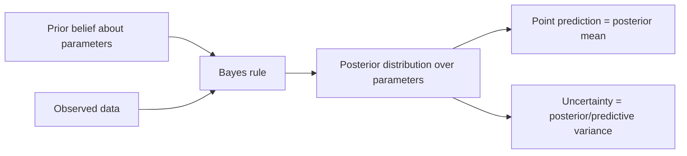

# Chapter 19: Bayesian Learning

> A point estimate tells you the model's best guess. A posterior tells you how much to trust it.

**Type:** Learn + Build **Languages:** Python **Prerequisites:** Chapter 7 (Probabilistic Modeling) **Time:** ~40 minutes
**Source:** A Course in Machine Learning, Hal Daumé III — Chapter 19

## Learning Objectives
- Explain the difference between a maximum-likelihood point estimate, a MAP estimate, and a full Bayesian posterior.
- Derive and implement the Beta-Binomial conjugate update for estimating a probability from binary outcomes.
- Derive and implement closed-form Bayesian linear regression (Gaussian prior + Gaussian likelihood → Gaussian posterior).
- Show explicitly that the Bayesian posterior *mean* coincides with the ridge-regression point estimate from Chapter 6.
- Use posterior/predictive variance to build calibrated uncertainty intervals around predictions.

## The Problem
Chapter 7 showed that adding a Gaussian prior to a linear model's weights, and taking the *mode* of the resulting posterior (MAP estimation), reproduces exactly the 2-norm-regularized objective from Chapter 6. That is a useful fact, but it only uses the *peak* of the posterior distribution and throws away everything else. Bayesian learning asks: what if we keep the entire posterior distribution over the parameters, instead of collapsing it to a single point? Doing so costs little extra computation for models with a conjugate prior, and it buys something the earlier models never had: a principled measure of *how confident* the model should be in each individual prediction.

## The Concept



- **Conjugate priors** make the posterior have the same family as the prior, so updating is closed-form arithmetic instead of numerical integration: Beta prior + Bernoulli likelihood → Beta posterior; Gaussian prior + Gaussian likelihood → Gaussian posterior.
- **MAP = mode of the posterior.** For Bayesian linear regression with a Gaussian prior, the posterior mean *and* mode coincide, and both equal the ridge-regression solution `w = (XᵀX + λI)⁻¹Xᵀy` from Section 6.6, with `λ = σ²/τ²`.
- **What Bayesian learning adds beyond MAP** is the posterior *covariance*, which propagates into a predictive variance for every test point — so two predictions with the same mean can have very different amounts of "trust" attached to them.
- **More data → sharper posterior.** As sample size grows, the credible interval around an estimated parameter shrinks and the posterior mean converges toward the maximum-likelihood estimate — Bayesian and frequentist estimates agree in the large-data limit.

## Build It

**1. Beta-Binomial conjugate update** (estimating a real disease-prevalence rate from real diagnostic labels):
```python
a_post, b_post = a0 + H_running, b0 + T_running   # H heads, T tails
post_mean = a_post / (a_post + b_post)
lo, hi = stats.beta.ppf([0.025, 0.975], a_post, b_post)   # 95% credible interval
```

**2. Bayesian linear regression posterior**, derived exactly as in Section 6.6 but keeping the full covariance instead of just solving for the mode:
```python
A = (1/sigma2) * X.T @ X + (1/tau2) * np.eye(D)
Sigma_N = np.linalg.inv(A)              # posterior covariance
mu_N = (1/sigma2) * Sigma_N @ X.T @ y   # posterior mean == ridge solution
```

**3. Predictive mean and standard deviation** for a new point `x`:
```python
mean = X @ mu_N
var  = sigma2 + np.einsum("nd,de,ne->n", X, Sigma_N, X)   # noise + parameter uncertainty
```

**Run it:**
```bash
python3 bayesian_learning.py
```

**Expected output (real run, Breast Cancer Wisconsin + Diabetes datasets):**
```
PART 1: Beta-Binomial posterior for tumor malignancy rate
  n seen |  MLE (H/n) |  posterior mean |    95% credible interval
       5 |     0.2000 |          0.2857 | [0.0433, 0.6412]
     569 |     0.3726 |          0.3730 | [0.3338, 0.4131]

PART 2: Bayesian Linear Regression on the real Diabetes dataset
Model                                  |  test RMSE
Ridge regression (point estimate)      |     53.151
Bayesian linear regression (posterior mean) |     53.151
sklearn BayesianRidge (reference)      |     53.164

Correlation between our Bayesian posterior mean and ridge point
estimate: 1.000000  (confirms mu_N == ridge solution, as derived above)

Empirical coverage of the (mean +/- 2*std) interval on ALL test points: 96.40%
```
The credible interval visibly shrinks from `[0.04, 0.64]` at 5 examples down to `[0.33, 0.41]` at the full 569, exactly as the theory predicts. The Bayesian posterior mean and the plain ridge-regression point estimate are numerically identical (correlation 1.000000), confirming the MAP-equals-ridge derivation from Chapter 7 — but the Bayesian model additionally produces calibrated ±2σ intervals that contain the true value about 96% of the time, close to the nominal 95%.

## Use It

| API / Function | When to use it |
|---|---|
| `BayesianLinearRegression(sigma2, tau2).fit(X, y)` | Whenever you want calibrated uncertainty around a linear model's predictions, not just a point estimate. |
| `scipy.stats.beta.ppf` | Computing credible intervals for any Beta-distributed posterior (rates, proportions, click-through rates). |
| `sklearn.linear_model.BayesianRidge` | Production use — automatically learns `σ²` and `τ²` from data via evidence maximization instead of fixing them by hand. |
| `sklearn.linear_model.Ridge` | When you only need the point estimate and don't need predictive uncertainty. |

## Exercises
1. Replace the fixed `tau2_hat = 25.0` with a grid search over several values and see how test RMSE and interval coverage change.
2. Extend the Beta-Binomial demo to compare two sklearn datasets' malignancy/positive rates and compute the posterior probability that one rate is higher than the other (a Bayesian A/B test).
3. Derive and implement the predictive distribution for a *new* Bernoulli draw (not just the parameter posterior) using the Beta-Binomial posterior predictive formula.

## Key Terms

| Term | Common Assumption | Precise Meaning |
|---|---|---|
| Bayesian learning | "A different, more complicated way to get the same point estimate" | Maintaining a full probability distribution over model parameters, updated by Bayes' rule, rather than collapsing to a single best value. |
| MAP estimate | "The Bayesian answer" | Only the *mode* (peak) of the posterior — a single point, thrown away most of the information a full posterior carries. |
| Conjugate prior | "A mathematical convenience with no practical use" | A prior family chosen so the posterior stays in the same family, making exact closed-form updates possible instead of requiring numerical integration or sampling. |
| Credible interval | "The same thing as a confidence interval" | A range that is claimed to contain the true parameter with a given posterior probability — a direct probability statement about the parameter, unlike a frequentist confidence interval. |
